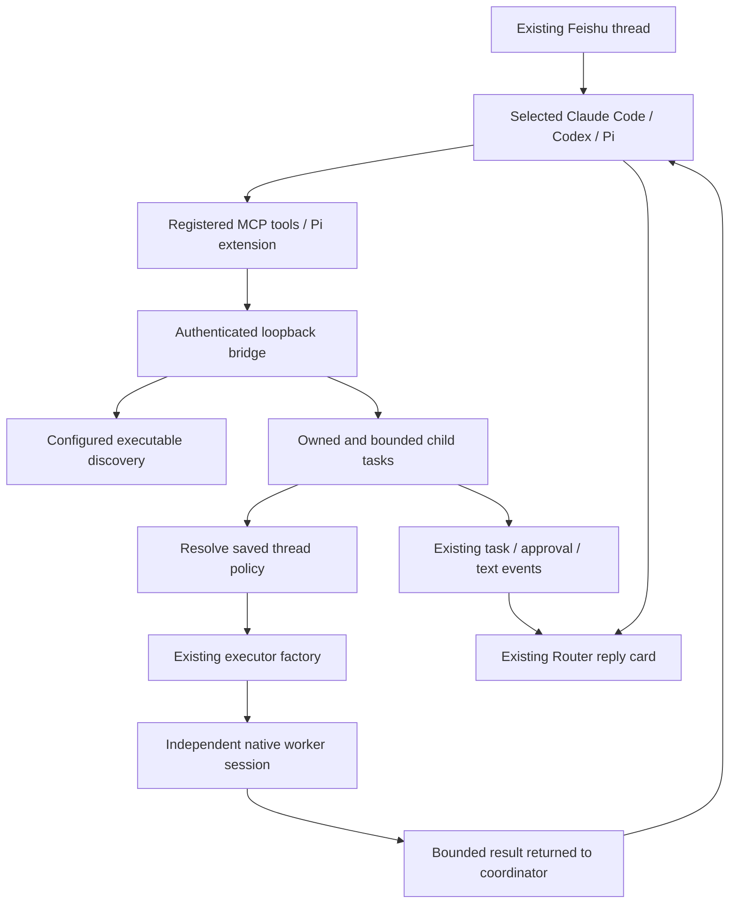

# Cross-Backend Delegation Plan

## Phase 2: reusable isolated worktrees and explicit integration

Contract for CLI 1.6.130; supersedes Phase 1's Git serial-dispatch restriction.
Non-Git directories retain that restriction in code, with no implicit Git init.

1. Keep native worker identity tied to parent thread, backend, canonical source
   cwd, and workspace generation. Pool independent Git lanes and reuse each
   lane's worktree directory only after exit and artifact accounting.
2. Capture a shared cohort baseline through a temporary index, including relevant
   working changes. Do not modify the source index. Limit snapshots to 10,000
   files and 128 MiB; reject broken metadata, existing conflicts, submodules,
   unsafe links, and known untracked credentials. Ignored dependencies are not
   copied. Validate actual tree bounds after Git clean filters. Grant the exact
   owned execution cwd without changing global policy.
3. Start each Git task in a fresh detached checkout anchored by private refs,
   never a publishable worker branch. Up to five global starting/running slots
   permit parallel checkout-isolated work; excess tasks retain FIFO queueing.
   CLI 1.6.131 raises this global cap from the three slots in 1.6.130.
   Worktrees are not OS sandboxes or isolation from shared Git configuration.
4. After confirmed process exit, preserve immutable output and native Git history
   before normalizing the owned index. Success and integration remain separate.
   Unresolved artifacts, changed branch identity, or unknown dirty files block
   lane reuse. No-change tasks can reuse directly; pending lanes are excluded
   from the ready pool, without corrupting other healthy same-backend lanes.
5. Add `remote_cli_integrate` for inspect/apply/retain. Require owned identity,
   completed workers, an exact inspected delivery revision, and lifecycle
   revalidation. Use an isolated merge checkout compatible with Git 2.34.
   Conflicts leave source files untouched. Apply changes without staging,
   committing, or pushing; retain preserves intentionally unmerged artifacts.
   Check both endpoints of renames. Preserve private before/target recovery refs
   and a durable receipt before file application. Failed/interrupted application
   may have changed delivery files and requires manual comparison, not assumed
   rollback or automatic reapplication.
6. Capture a new delivery baseline after integration before reusing a lane.
   Warn the resumed model to re-read current files. Artifact refs and records
   survive diagnostic expiry and conversation deletion for manual recovery.
   Do not automatically remove recovery files or publish internal refs.
7. Preserve Router protocol version 1, same-backend prohibition, sandbox policy,
   individual cancellation, cumulative admission limits, completion barriers,
   and native executor behavior. Refuse ambiguous plain-text worker input;
   request-specific approvals remain supported. Peer messaging is still deferred.

Verify real temporary Git worktrees, dirty inputs, parent-index preservation,
committed and binary outputs, conflicts, revision/ownership guards, retained and
unknown files, directory/session reuse, concurrency and queued followers,
non-Git compatibility, tool registration, and the existing thread workflow.
Mocked executor tests do not establish provider authentication or live throughput.

## Phase 1: multiple accepted tasks with serial dispatch

Contract for CLI 1.6.129. This is a scheduling foundation, not simultaneous
multi-agent execution or worker-to-worker communication.

1. Accept independent objectives on different backends under the existing
   request scope. Keep one task ID, status, bounded result, and cancellation
   handle per task. Do not infer dependencies or explicitly forward sibling
   results; a reused same-backend lane still retains its own previous context.
2. Serialize admission and dispatch in FIFO order. Keep the canonical workspace
   lease owned by the request, separately from execution slots. One worker per
   request and three occupied starting/running slots per CLI remain the limits.
   Other overlapping requests, busy direct threads, and new requests without an
   initial slot fail admission rather than joining a global waiting queue.
3. Persist `queued` with `acceptedAt`; set `startedAt` only at dispatch. Queue
   waits expire one hour after admission independently of native activity limits.
   Count 12 accepted tasks cumulatively across coordinator continuations, including
   failures/cancellations; only wholly unaccepted setup rolls back reservations.
4. Revalidate canonical cwd, generation, and ownership before starting. Wait for
   native exit and reusable lane metadata before advancing. Normal failure leaves
   independent siblings runnable; uncertain cleanup quarantines the workspace
   and reports all remaining tasks as interrupted without starting them. An
   uncertain setup or cleanup retains its occupied global slot until restart.
5. Fence admission/dispatch before close or abort. Cancel queued tasks without
   creating, aborting, or destroying a backend. Collect in-flight admissions and
   all accepted task results before continuation; acknowledge results only after
   a successful coordinator execution. Restart reconciles queued/running records
   as interrupted diagnostics without replay or cross-request delivery.
6. Use existing notices for queue status. Emit the existing `started` progress
   phase only at dispatch; never send an unknown `queued` phase to a Router.
   Preserve existing peer compatibility, worker policy, and native executor code.

Implementation targets are `DelegationManager`, `DelegationStore`, shared tool
descriptions, and never-started result notices. Regression coverage must exercise
FIFO/failure isolation, independent cancellation, cumulative quotas, concurrent
admission/idempotency, queue deadlines, ownership/generation/cwd validation,
close/setup/exit races, lane readiness, restart/pruning, completion barriers, and
old-peer notice fallback. Synchronize release manifests, both release documents,
all READMEs, and repository guidance; validate builds and both package suites.
Live provider behavior and simultaneous-worker benchmarks are not established
by mocked scheduler tests. Peer messaging and actual parallelism are later work.

## Follow-up: durable isolated delegated worker lanes

Status: implemented and validated, 2026-10-01. Version 1.6.104.

- Persist an isolated lane for each `(parent thread ID, target backend, workspace generation)`.
  Its synthetic `delegate-lane-<uuid>` ID isolates native session pointers from every direct thread session.
- Destroy the worker process after every task, and mark a lane reusable only after its process exit is confirmed.
  An uncertain shutdown marks the lane dirty and quarantines its workspace rather than risking reuse.
- Reapply the parent thread's configured model and effort whenever a lane starts. Do not infer or change a model from a backend label.
- Preserve lanes through direct `/clear`, `/new`, backend switches, and `/delegation off/on`.
  `/cd` advances a persisted workspace generation and discards old lanes; `/delegation reset [backend]` removes idle lane state; thread deletion removes all lanes.
- Never import old direct session pointers or the former per-task `delegate-<taskId>` pointers into a lane.
  A missing native session may create one fresh lane only when an executor explicitly confirms that it failed before objective dispatch.
- Keep the protocol unchanged. Validate durable metadata, direct-pointer isolation, generation invalidation, reset behavior, confirmed exit, and safe missing-session retry.

---

## Follow-up: cross-backend-only workers and result retention

Status: implemented and validated, 2026-09-30. Version 1.6.95.

- Reject managed delegation to the coordinator's own backend in the shared
  worker policy, before probing, persistence, or worker creation. Discovery
  reports the same restriction; native backend task/subagent tools are unchanged.
- Keep the current sandbox boundary: restricted coordinators have no eligible
  workers until cross-backend sandbox equivalence is implemented. Do not weaken
  sandbox settings or silently fall back to unrestricted execution.
- Remove the cumulative intermediate-output abort and retain bounded terminal
  results with UTF-8-safe beginning/end truncation. Timeout and cleanup remain.
- Verify 42 allowed different-backend combinations, seven same-backend
  rejections, result delivery, sandbox rejection, and mixed-version behavior.

Validation: both packages build; 1,367 CLI tests and 615 Router tests pass.
CLI line coverage is 87.61%; WorkerPolicy and the shared tool contract have
100% coverage. Tests use mocked executors and the real delegation bridge.
A separate Codex transport test confirms independent executor callbacks reject
other thread IDs. This is code-level isolation evidence, not a reconstruction
of historical live byte counters. Claude cross-review could not run because
the configured provider returned an authentication error (HTTP 403).

## Follow-up: recover result delivery and parse nested Markdown

Status: implemented and validated, 2026-09-29. Version 1.6.89.

- Gate recovery on launches accepted by the current coordinator execution, not
  all historical tasks. Advance the revision before asynchronous launch setup.
- Stage exact result IDs for the active execution and acknowledge them only on
  success. Ignore late tool responses from earlier executions. Retain failed
  deliveries for bounded fallback output without automatic cross-request replay.
- Disable the bridge between executions and during compaction. Cancellation
  prevents retries, acknowledgement of late success, and failure-result output.
- Parse Markdown code-block boundaries with markdown-it 14, preserving Node 18
  support. Filter image links in lists and quotes while retaining code examples.
- Cover compaction/retry, failed and explicit-result delivery, multiple batches,
  late responses, abort during recovery, and nested image references.

Validation: both packages build; 1,338 CLI tests and 590 Router tests pass.
CLI line coverage is 87.38%. ToolFormatter coverage is 88.44% for lines,
81.48% for functions, and 85.18% for branches. Router image integration tests
exercise the real image formatter and nested streamed Markdown. An independent
source review found no additional concrete issue. Native model context-limit
recovery and live Feishu rendering were not exercised; workflow tests use
mocked native executors with the real delegation bridge.

## Follow-up: enforce coordinator completion

Status: implemented and validated, 2026-09-29. Version 1.6.88.

- Track terminal-result delivery independently of worker completion. Running
  snapshots and user-facing progress do not count as result delivery.
- Suppress coordinator prose, plans, and images while results are outstanding;
  retain program-owned task progress and real approval/question prompts.
- On a successful early coordinator return, deactivate the tool bridge, drain
  in-flight launches, wait for bounded worker cleanup, and resume the same
  coordinator with bounded terminal results. Keep the parent operation busy.
- Do not replay the original request or attachments. Cancelled, failed, and
  shutting-down parents must not resume. Preserve ordinary opt-out execution.
- Verify unread completion, launch races, abort during host waiting, child
  failure/timeout, stale callback suppression, queue order, and attachment handling.

Validation: both packages build; 1,328 CLI tests and 584 Router tests pass.
CLI line coverage is 87.29%. The workflow tests use the real delegation bridge
with mocked native executors. A bounded independent source review found no
additional concrete issue. Live Feishu rendering and native model continuation
were not revalidated for this change.

## Follow-up: isolate disabled threads

Status: implemented and validated after commit `175cd22` on 2026-09-29. Version 1.6.80.
The user requested staged rollout with ordinary execution preserved when
delegation is disabled and authorized committing and pushing this follow-up to
main after validation. Publication and deployment are outside this change.

- [x] Keep never-enabled threads out of delegation configuration and workspace
  admission checks. Record which backends have owned tools so opt-out cleanup
  still works after backend switches and CLI restarts.
- [x] Restrict process-group ownership, session replay filtering, and delegated
  sandbox preparation to coordinators with delegation enabled and managed workers.
- [x] Restore ordinary retry, approval, and lifecycle behavior; retain credential
  redaction in diagnostic logging. Opt-out may recycle a previously managed
  process once to remove its tools, while preserving the native conversation.
- [x] Test never-enabled execution, enable/disable transitions, persisted cleanup,
  ordinary cancellation, and mixed enabled/disabled threads in one workspace.
- [x] Synchronize documentation and versions, then run builds and regression tests.

Workspace reservations coordinate opted-in threads and managed workers only.
They must not reject ordinary requests in opted-out threads. Those threads, like
external editors and native parallel tools, can still access the same files;
this feature does not claim filesystem isolation between them.

The thread's persisted `delegationBackends` records which native sessions may
retain managed tools. Never-enabled threads do not call `configureDelegation`;
opted-out threads clean only recorded backends before ordinary turns or native
slash commands can resume them. Cleanup is idempotent within each executor and
preserves native conversation pointers. Managed workers have an explicit runtime
role instead of changing the default lifecycle of every backend process.

Validation for this follow-up:

- Focused delegation and executor regression run: 259 tests passed in 14 files.
- Final full suite after slash-command cleanup coverage: 1,293 CLI tests and 573
  Router tests passed across 94 files, including rolling-upgrade compatibility.
- `npm run build`: both packages passed at version 1.6.80.
- Both root README delegation sections match; heading hierarchies remain aligned.
  Package versions and lockfile entries are synchronized. `git diff --check` passed.
- Real subprocess fixtures cover ACP tool registration, restoration, opt-out,
  and destroyed-worker cleanup. This follow-up did not repeat authenticated live
  model calls; the original verification and its limits are recorded below.
- Logs: `/tmp/remote-cli-delegation-isolation-targeted.log`,
  `/tmp/remote-cli-delegation-isolation-full-tests.log`, and
  `/tmp/remote-cli-delegation-isolation-build.log`.
- Validation did not start or stop production processes or publish or deploy
  packages. The follow-up is ready for the authorized commit and push.

## Initial implementation record

Status: both phases implemented and validated on 2026-09-29. Version 1.6.79.
The initial Claude Code/Codex/Pi phase and the authorized expansion to every
existing backend are complete. Live authentication/configuration limits are
recorded separately below; they are not reported as successful model tests.
The user authorized committing and pushing these changes to main after validation.
No deployment occurred.

## Execution record

The approved first release supports Claude Code, Codex, and Pi as coordinators
and workers, including all nine directed combinations. Keep the existing thread
and backend interaction. The user authorized autonomous implementation, testing,
and maintenance of this document, followed by a request to commit and push.
Package publication was not requested.
Do not start, stop, or deploy the production Router.

## Expansion to all installed backends

The second phase preserves the same opt-in thread workflow and adds AGY,
OpenCode, Kimi Code, and ZCode. Each backend should be a worker and, where its
native protocol can register tools reliably, a coordinator. Do not substitute
prompt-only instructions for actual tool registration or claim a live pairing
has passed solely from mocked tests.

- [x] Verify all four native tool-registration and session-resume contracts.
  ACP session MCP servers are the starting point for OpenCode and Kimi; AGY
  and ZCode require their own native integration and isolated configuration.
- [x] Expand discovery and worker policy, including ZCode bundled-script
  discovery, missing executables, sandbox restrictions, and session cleanup.
- [x] Implement coordinator adapters without editing the user's global MCP
  configuration. Opt-out must remove managed tools from resumed conversations;
  delegated workers must not acquire the coordinator's managed tools.
- [x] Cover all supported directed pairs at the manager boundary, plus actual
  wire registration, resume, opt-out, cancellation, and permission behavior.
- [x] Run live checks when installation and existing authentication permit it.
  Record authentication/quota/environment blockers separately from code errors.
- [x] Review the final diff, synchronize README files and package versions,
  run builds and tests, and update this document with the verified matrix.

Carry forward all first-phase limits and task ownership rules. Only Claude Code
and Codex currently provide an enforced read-only worker policy; reject that
mode for other workers. A restricted coordinator still cannot delegate to a
different backend. This expansion does not authorize deploying the Router or
changing the user's backend authentication or global MCP settings.

## First-phase execution checklist

- [x] Capture the accepted scope and continuity instructions.
- [x] Verify coordinator protocols and installed-version behavior.
- [x] Implement discovery, task ownership, limits, and worker lifecycle.
- [x] Register native tools in Claude Code, Codex, and Pi.
- [x] Integrate thread controls, task progress, approvals, queues, and cleanup.
- [x] Add meaningful regression, compatibility, and adapter coverage.
- [x] Run real-backend smoke tests across all nine directed combinations.
- [x] Review the diff, synchronize documentation and versions, build, test, and
  verify npm package contents.

Baseline: main at `6c378be`, version 1.6.77. Reference branch:
`codex/pi-feishu-orchestration` at `507a091`. Implementation is on main and does
not depend on merging the reference branch.

## Expansion implementation and evidence

The expansion adds all seven backend IDs to discovery, tool schemas, and worker
policy. OpenCode/Kimi use standard ACP stdio MCP entries on new/load; ZCode uses
its own session create/resume schema, with `isolation: session` and a 35-second
MCP timeout. Ordinary ZCode sessions omit the override. AGY detaches only its
per-thread config directory symlink, uses native `agy mcp add` (including its
JSON-with-comments parser), and restores the original configuration on opt-out.
Bridge credentials stay in the child environment for AGY, never in its MCP file.

All transports keep parent and worker sessions separate. Managed workers receive
no delegation server/extension. ACP session-load history is suppressed from live
output only for delegation-enabled coordinators and managed workers. Ordinary
session-load output retains the pre-delegation behavior. Changing delegation waits for old processes to exit before resuming;
worker workspace leases are held until exit is confirmed. Cleanup never restarts
a destroyed ACP worker just to delete its session pointer. Normal explicit
thread deletion retains its existing native deletion attempt.

| Backend | Local version | Additional live verification | Model delegation result |
| --- | --- | --- | --- |
| AGY | 1.2.12 | Native MCP config command succeeded in a private thread HOME | Blocked: authentication required |
| OpenCode | 2.0.4 | ACP process started and returned its authentication error | Blocked: provider authentication required |
| Kimi Code | 0.43.1 | ACP process started and returned its authentication error | Blocked: onboarding/authentication required |
| ZCode | 0.16.9 | Native MCP reported connected with four tools; active-session resume RPC accepted | Blocked: no selected model |

A subsequent ZCode cross-process resume probe returned `Session not found` for
an unused session whose model was unconfigured. Persisted-session restoration
has not been validated live for these four backends. A regression now allows
recreation for an explicit missing-session error while preserving the original
session pointer on MCP or other load failures. No accounts were provisioned or
changed to bypass the live-test blockers.

The official ACP [session lifecycle](https://agentclientprotocol.com/protocol/session-setup)
requires stdio MCP support and supplies servers on creation and loading. AGY's
[configuration documentation](https://antigravity.google/docs/cli/features/)
and its local `mcp add --help` identify the user MCP configuration. The installed
ZCode bundle's session schemas and runtime conversion were inspected locally.

Known ZCode limitation: a nonempty native session MCP override replaces custom
user-configured MCP servers while enabled. Native tools and plugin MCP servers
remain available; opt-out restores normal configuration. This is documented in
both READMEs and `/delegation` output. Merging arbitrary native user MCP settings
is deferred rather than duplicating ZCode's version-specific configuration loader.

- Original expansion tests covered all 49 directed backend pairs. The 1.6.95
  policy allows 42 different-backend pairs and rejects the seven same-backend
  pairs, retaining model-selection and separate-session coverage.
- Real subprocess fixtures cover OpenCode/Kimi/ZCode registration, process
  recycling, resume, opt-out, history replay suppression, and cleanup.
- AGY filesystem/process tests verify global config preservation, independent
  worker configuration, stale-registration cleanup, rollback on config failure,
  and restoration of the original directory link.
- `npm run build`: CLI and Router passed.
- `npm test`: 1855 tests passed, CLI 1282 and Router 573, across 94 files.
- Follow-up rolling-upgrade regressions passed: a legacy CLI completes commands
  and streaming replies alongside a current CLI on the same Router; a delegated
  worker uses text approval when an older Router has no approval-card capability.
- The targeted protocol, lifecycle, discovery, policy, and adapter run passed
  187 tests across 13 files. New delegation modules and the AGY configuration
  adapter reached 90.59% lines/statements, 87.43% branches, and 95.23% functions.
  MCP subprocess coverage is not merged into that report; the actual stdio
  protocol test passed separately.
- `npm pack -w @yu_robotics/remote-cli --dry-run --json --ignore-scripts`:
  the compiled MCP server, Pi extension, contract, manager, and AGY configuration
  adapter are present in the installable CLI package.
- `git diff --check`: passed. Root README delegation sections and heading
  structures match. Root, CLI, Router, and lockfile versions are all 1.6.79.
- Validation did not change the production Router or publish packages. The user
  subsequently authorized committing and pushing the verified changes. Live
  Feishu UI and macOS runtime validation remain unperformed.

Temporary evidence:

- `/tmp/remote-cli-expansion-smoke-result.json`: the four explicit live blockers.
- `/tmp/remote-cli-expanded-registration.log`: four connected ZCode MCP tools.
- `/tmp/remote-cli-expanded-resume.log`: the cross-process missing-session probe.
- `/tmp/remote-cli-expanded-build.log`: successful build output.
- `/tmp/remote-cli-expanded-full-test.log`: expansion baseline test output.
- `/tmp/remote-cli-delegation-rolling-upgrade-tests.log`: latest full CLI and
  Router test output, including mixed-client and approval-fallback regressions.
- `/tmp/remote-cli-expanded-coverage/coverage-summary.json`: targeted coverage.
- `/tmp/remote-cli-expanded-pack.json`: installable CLI package contents.

## First-phase verification results

- `npm run build`: CLI and Router passed.
- `npm test`: 1797 tests passed, CLI 1225 and Router 572, across 92 files.
- New delegation modules: 89.75% lines/statements, 84.84% branches, and 94.82%
  functions in the targeted V8 coverage run. MCP subprocess coverage is not
  merged into that report; its real stdio protocol test passed separately.
- `npm pack -w @yu_robotics/remote-cli --dry-run --json --ignore-scripts`:
  compiled MCP server, Pi extension, contract, and manager are included.
- `git diff --check`: passed. Root README sections and heading structures match.
  At this earlier checkpoint, all package and lockfile versions were 1.6.78.
- The repeated live matrix passed all nine unique pairs and all three parent
  turns. Each worker independently read `fixture.txt` and returned the expected
  marker. The same-backend combinations used distinct sessions.
- Claude Code 2.1.276, Codex 0.154.0, and Pi 0.87.1 were exercised on Linux.
  Claude Code used the existing Kimi-backed account configuration; this verifies
  the Claude Code protocol, not a particular Anthropic model. Pi used
  `openai-codex/gpt-5.6-luna` from an isolated test installation.
- Fresh/resumed tool registration passed for all three coordinators. Additional
  native read-only delegation passed for Claude-to-Claude and Codex-to-Codex,
  without approving any extra request in the final read-only probes.
- Live sandbox testing found and fixed two issues: Codex MCP invocation needed
  a scoped tool approval configuration, and new Codex read-only sessions needed
  their private TMPDIR created before native sandbox startup.
- No live Feishu UI or macOS runtime test was performed. Router forwarding,
  cards' existing event flow, registration/approval replay, and queue handling
  were verified by automated integration tests. Production services were not
  restarted.
- Temporary Pi authentication used a private access-token-only fixture, with no
  copied refresh token or permanent account configuration changes. The fixture
  and its location file have been deleted. Pi's test installation remains at
  `/tmp/remote-cli-delegation-tools`; production configuration does not reference it.

Local diagnostic evidence (temporary files, not repository dependencies):

- `/tmp/remote-cli-delegation-final-tests.log`
- `/tmp/remote-cli-delegation-build.log`
- `/tmp/remote-cli-delegation-coverage/coverage-summary.json`
- `/tmp/remote-cli-delegation-matrix-result.json`
- `/tmp/remote-cli-delegation-matrix-final.log`
- `/tmp/remote-cli-delegation-sandbox-final-result.json` (Claude passed; records
  the Codex TMPDIR failure before the fix)
- `/tmp/remote-cli-delegation-sandbox-codex-corrected-result.json` (Codex passed
  after the TMPDIR fix)

Continuation: implementation, review, build, automated validation, and packaging
checks are complete for both phases. The user authorized committing and pushing
the completed implementation and compatibility regressions to main.
Remaining live verification requires authenticated/configured backends; the
table above records each blocker. Do not repeat live
model calls against the four unauthenticated/unconfigured backends without a
configuration change. Deployment and package publication have not been authorized.

## 1. Delivered product contract

Keep the existing thread, backend, workspace, and native conversation. The
selected backend remains responsible for the final answer. Claude Code, Codex,
Pi, AGY, OpenCode, Kimi Code, ZCode, and DSH can discover local workers, assign a task, await its
result, and continue that conversation. Managed workers must use a different
backend. Same-backend requests are rejected before launch; native backend
task/subagent tools remain backend-owned.

- `/delegation` reports the per-thread setting and executable discovery.
- `/delegation on|off` changes future turns while the thread is idle. The setting
  defaults to on from CLI 1.6.121 for new and legacy threads without a preference.
  Explicit saved opt-outs stay off. Resolve the default when reading, without
  rewriting old metadata or resetting conversations. Explicit choices persist
  through context resets, backend switches, and restarts. Default-on exposes
  tools without automatically launching workers. Queued work must be cleared
  before changing its policy. Earlier phase notes retain their historical
  opt-in validation context; this contract describes the current default.
- Unsupported coordinators keep their normal execution behavior; `/delegation`
  reports their lack of support, and enabling is rejected.
- Workers receive only a self-contained objective supplied by the coordinator.
  They do not inherit the parent's transcript, attachments, or hidden context.
- Workers do not become user-facing threads. Task progress appears in the
  parent's reply card, and the coordinator summarizes worker results.
- Installation, authentication, quota, and task success are separate facts.
  Discovery does not send a model request or claim an account is authenticated.
- There is no automatic retry, fallback to another provider, recursive managed
  delegation, cross-device dispatch, or separate orchestration mode.
- Router-first upgrades are a compatibility requirement: supported protocol-v1
  CLIs must retain ordinary command execution, output, and task completion while
  newer CLIs use delegation on the same Router. Package version equality must
  not become a connection requirement. This feature adds no wire message type
  or required field and does not raise the minimum accepted protocol version.
  Delegation tools execute locally and reuse existing tool events. Older CLIs
  need an upgrade only to enable delegation itself. Optional cards/recovery are
  negotiated independently for each connection; missing capabilities stay off.

## 2. Architecture and retained reference ideas

| Reference branch idea | Adopted behavior | Boundary |
| --- | --- | --- |
| Explicit Pi tools | Native tool registration on all three coordinators | No dependence on skill discovery or prompt-only tool simulation |
| Backend registry | Canonical backend IDs, configured binaries, cached availability | Does not change the primary backend |
| Task ownership and workers | Dedicated existing executor per child and parent-scoped IDs | Does not duplicate backend transports |
| Persistent task state | Atomic bounded JSON records with interrupted-state reconciliation | No mandatory SQLite or full transcript archive |
| Task visibility | Existing Task cards and approval messages | No new Feishu workflow or extra thread buttons |
| Resource control | Launch, concurrency, time, output, and storage limits | No promise of OS isolation for unrestricted backends |

The reference `codex/pi-feishu-orchestration` remains a source of design ideas,
not a merge dependency. This implementation is built on main and does not adopt
its Pi-only primary workflow, global configuration changes, scheduling, Bitable
integration, or replacement of normal thread interactions.

## 3. Module and tool contracts

| Module | Responsibility |
| --- | --- |
| `delegation/contract.ts` | Four tool schemas, shared instructions, MCP launch data |
| `BackendRegistry.ts` | Five-second version probes, configured paths, 30-second cache |
| `DelegationBridge.ts` | Per-thread authenticated loopback endpoint active only during a parent turn |
| `mcpServer.ts` | Stdio JSON-RPC MCP adapter for Claude and Codex |
| `piExtension.ts` | Explicit Pi tool registration without replacing native tools |
| `WorkerPolicy.ts` | Resolve saved permissions against the real parent thread |
| `DelegationManager.ts` | Ownership, idempotency, leases, bounded worker execution and cleanup |
| `DelegationStore.ts` | Atomic private records, bounded retention, restart reconciliation |
| `MessageHandler.ts` | Opt-in, queue integration, parent callbacks, approvals and cancellation |

| Tool | Behavior |
| --- | --- |
| `remote_cli_list_backends` | Return installed backends, versions and applicable restrictions |
| `remote_cli_delegate` | Accept a different-backend task; Git workers use isolated worktrees and may run concurrently; non-Git followers queue serially; `inherit` is default |
| `remote_cli_result` | Return an owned task's state and final result; wait up to 25 seconds |
| `remote_cli_cancel` | Stop an owned worker; existing filesystem changes are not rolled back |
| `remote_cli_integrate` | Inspect and revision-guardedly apply or retain an owned Git artifact after all workers finish |

Worker results are task data, not new user instructions. A successful native
turn does not prove acceptance criteria were met; the coordinator must check
the returned result and report unresolved work. A call ID cannot be
reused with different arguments. Duplicate calls within a turn reuse their
original promise. A task ID from another turn cannot be queried or cancelled.
Native polling tool cards are suppressed; the manager emits one task entry and
one terminal result. Worker questions are forwarded through the parent card.

## 4. Native coordinator adapters

| Coordinator | Registration and resumption | Worker implementation |
| --- | --- | --- |
| Claude Code | Compose the delegation MCP server with existing approval MCP settings; recycle idle process while retaining session ID | `ClaudePersistentExecutor` |
| Codex | Apply an MCP configuration override to both `thread/start` and `thread/resume`; explicitly disable it after opt-out | `CodexAppServerExecutor` |
| Pi | Explicit `--extension` with process-local URL/token; retain session file on enable/disable | `PiExecutor` |
| OpenCode / Kimi | Pass session-local stdio MCP servers on ACP new/load; managed sessions suppress replayed history | `AcpExecutor`, `AcpClient` |
| ZCode | Pass native session MCP servers with session isolation; omit overrides when disabled | `ZCodeClient` |
| AGY | Detach only the per-thread config symlink, register via native `mcp add`, restore original config on opt-out; keep credentials in process env | `AgyExecutor`, `agy/AgyDelegationConfig` |

All workers have unique synthetic remote-cli session keys and use the existing
factory, model selection, effort selection, sandbox, image-capable transport,
and native error handling. No worker receives the managed delegation tools.
Ordinary native tools remain enabled, so native backend-internal subagents are
outside the managed delegation depth limit.

The installed Codex schema has `dynamicTools` on `ThreadStartParams`, but not
`ThreadResumeParams`. MCP configuration was verified on both new and resumed
conversations, avoiding a forced conversation reset. Reference:
[official Codex app-server documentation](https://developers.openai.com/codex/app-server/).

Read-only smoke testing also exposed an existing Codex sandbox startup bug:
`TMPDIR` was configured but not created for fresh read-only sessions. The fix
creates its private directory without adding model writable roots, with a
regression test. This affects fresh Codex read-only sessions as well as workers.

Read-only smoke testing found that Codex emits an additional MCP tool approval
elicitation for the local bridge. The coordinator override now limits the server
to these five tools and pre-authorizes their invocation after `/delegation on`,
using the official `default_tools_approval_mode` setting. Child sandbox policies
and permission requests remain unchanged. Claude similarly adds only those five
MCP tool names to its process-local allow list, retaining native ask/deny rules.
See [Codex configuration reference](https://developers.openai.com/codex/config-reference/).

## 5. Permissions and workspace coordination

- Resolve the coordinator's effective sandbox policy using the real thread ID
  before creating the synthetic worker identity. Passing a fresh ID alone would
  miss per-thread policy files. When the coordinator is unrestricted, launch
  unrestricted workers without loading the target backend's saved sandbox policy.
  Do not modify saved policies or other backend approval options.
- Unrestricted coordinators support 42 different-backend directed pairs at the
  manager boundary; seven same-backend pairs are rejected. Restricted
  coordinators have no eligible managed workers: same-backend delegation is
  disabled, and equivalence between different native sandboxes is not assumed.
- Use `inherit` by default, including research tasks whose no-write requirements
  belong in the objective. `read_only` remains recognized for compatibility but
  is unavailable under the cross-backend-only policy. Unrestricted coordinators
  cannot enable an extra worker sandbox. Discovery and launch share this policy
  and explain why a target is unavailable; saved backend settings are unchanged.
- Worker approval cards omit Remember. Persistent grants should be configured
  on the real thread. Temporary worker policy/session pointers are cleaned up
  after execution; native CLI transcript retention remains backend-owned.
- Child approval decisions are bound to the original user, message, thread,
  request and executor. Registration replays pending approvals. Parent and child
  questions use the existing input flow; an answer does not create another task.
- Canonical workspace leases cover identical and ancestor/descendant paths.
  A worker cannot overlap another managed worker or another busy managed thread
  in those directories. Delegation-enabled threads cannot start model work in a
  leased workspace. Opted-out ordinary threads bypass delegation admission checks.
- This is not a filesystem lock. Opted-out threads, the coordinator's native parallel
  tools, unrestricted shell commands, and external editors can still access files.
  Instructions require the coordinator to await a writing worker before editing.
- The loopback bearer token prevents accidental cross-thread calls; it does not
  create isolation from other processes running with the same OS permissions.
  Launch logs redact MCP and sandbox configuration values.

## 6. Lifecycle, limits, and recovery

| Limit | Value |
| --- | --- |
| Active workers per parent | 1 |
| Active workers per CLI process | 3, in non-overlapping workspaces |
| Accepted tasks per parent request | 12 cumulative across continuations, including failures/cancellations |
| Managed delegation tool calls per turn | 500 |
| Queued-task wait | One hour after admission, independent per task |
| Worker liveness | 15 minutes without tool callbacks; 45 minutes while tools are active; no fixed total duration cap |
| Final result | 32 KiB, preserving beginning and end with a UTF-8-safe truncation marker |
| Automatic continuation results | 64 KiB combined JSON, preserving all task IDs and terminal states |
| Intermediate text/tool-result output | Not retained by the delegation manager; volume alone does not stop the worker |
| Objective | 24000 characters; diagnostic record stores first 1000 |
| Tool wait / HTTP timeout | 25 seconds / 32 seconds |
| Initial task record | Up to 10 seconds each for store initialization and the first durable write |
| Shutdown | Up to 2 seconds for abort, then 10 seconds for destroy |
| Session and metadata cleanup | Up to 10 seconds per cleanup stage after confirmed process exit |
| Task record retention | 200 terminal records, seven days |

CLI 1.6.95 removes the cumulative intermediate-output abort. Large tool reads
can finish with a concise result instead of failing before completion. Oversized
returned text and combined continuations omit their middle and set `truncated`
without changing task success or failure. These limits bound retained delegation
results, not the backend's own output buffers. Timeout, cancellation, and cleanup
remain enforced independently of output volume.

A failed parent, `/abort`, deletion, or CLI shutdown closes the scope and stops
managed children. Cancel remains idempotent. Cancellation during version probing
or initial persistence cannot start a worker after closure. A successful native
coordinator return is not sufficient to finish the parent request: the CLI drains
in-flight launches and unconsumed results, then resumes the same coordinator
session with terminal results. It rechecks cancellation before resuming, retains
the busy operation and queue order, and omits the original request and attachments.
If a successful execution consumed all results, no extra coordinator turn is
needed. Results are acknowledged only after that execution succeeds; failed
delivery retains a bounded terminal-result fallback. Model recovery and automatic
compaction can retry an execution that accepted no new worker launch, including
a continuation containing completed historical results. No failed execution
that accepted a new launch is replayed. Abort/shutdown suppress both continuation
and failure-result fallback. This is not automatic cross-request result recovery.
Session deletion and final metadata maintenance have deadlines;
an unavailable diagnostic store cannot hold a confirmed-exited worker forever.

If cleanup cannot be confirmed, return interrupted status and retain the
workspace lease and capacity reservation. Stop the worker and restart the CLI
before using the workspace for delegation-enabled work again. Opted-out ordinary
threads bypass this reservation. The queue does not wait forever on a broken
worker. Successful cleanup removes synthetic session pointers and policy files.

Router outages do not restart workers. Existing task recovery restores the
parent output route and replays pending approvals; disconnected child progress
is not buffered. Native result polling continues locally. A CLI restart marks
retained running records interrupted and does not replay their tasks or edits.
Persistent records are diagnostic; they are not resumable worker sessions.

## 7. Validation and release gate

The release must include:

- Unit coverage for ownership, discovery, sandbox inheritance, idempotency,
  capacity, nested workspace conflicts, timeouts, UTF-8 output bounds, cancellation,
  cleanup failure, record retention and restart reconciliation.
- Actual MCP subprocess framing tests and Pi extension registration/cancellation.
- Fresh/resumed coordinator configuration tests with native tools preserved.
- MessageHandler tests for queue draining, opt-in persistence, opt-out, child
  questions, parent termination, wrong-owner approvals and registration replay.
- Router forwarding/help coverage; no new wire protocol messages.
- Mixed-client compatibility coverage: legacy registration without metadata,
  ordinary commands, streaming and nested responses alongside a current CLI's
  delegated Task events, with acknowledgements limited to negotiated clients.
- New CLI with an older Router: delegated workers fall back to text approval
  when the registration response has no approval-card capability, and replies
  reach the worker rather than the coordinator.
- Full CLI/Router builds and tests, synchronized manifests/lockfile, paired root
  README sections, and package README updates.
- Real backend tool calls across all nine pairs. Distinguish these from mocked
  transport tests and do not claim untested live Feishu or macOS validation.

## 8. Deferred work

Native live verification of the four additional backends requires working local
authentication/model configuration. ZCode custom user MCP coexistence while
delegation is enabled requires a native merge API or an explicitly supported
configuration source; the current temporary override is disclosed to users.

Future changes may add cross-backend sandbox policy translation, detached workers,
parallel read-only workers, isolated worktrees, resumable worker conversations,
attachment transfer, additional future backends, richer progress, and orchestration
scheduling. Each should preserve the selected thread/backend contract and have
its own capability and failure checks. They are not required for this release.

## Follow-up: verified checkout reclamation (1.6.135)

This follow-up supersedes the historical worktree deferral above. Semantic
integration remains an explicit coordinator decision; physical checkout cleanup
is a framework lifecycle, not an agent prompt or another cleanup tool.

### Implementation contract

1. Run reclamation only after confirmed native process exit and successful
   no-change collection, or after a durable successful apply receipt. Require
   successful=true, applied disposition, exact current task/lane identity, and no
   blocked, pending, retained, failed/cancelled, or unresolved recovery state.
2. Keep conversation pointers, executor/lane IDs, artifact records, input/output
   refs, task refs, and original worker history. Never expire these with diagnostic
   records. Reset/delete retains the existing explicit native cleanup contract;
   it does not trigger a historical checkout sweep.
3. Independently audit actual bytes against saved Git blobs, without relying on
   copied index flags, stat caches, or filters. Bound files, directory entries,
   and total bytes. Verify detached HEAD, ownership/common repository, exact refs,
   modes, symlink targets, and registrations. Ignore no extra file or directory:
   even non-forced Git removal deletes ignored files. Transformed checkouts that
   cannot be proven byte-equivalent are retained, not guessed to be caches.
4. Persist present/reclaiming/reclaimed lifecycle and exact task/output/tree
   receipts around non-forced removal. Legacy omitted state means present.
   Resolve reclaiming+verified-intact by cancelling intent, or reclaiming+absent
   and unregistered by finalizing the receipt. Partial/foreign/locked state,
   missing legacy checkouts, and occupied reclaimed paths require manual recovery.
   Never automatically prune repository-wide metadata or overwrite unknown paths.
5. Recreate only an absent, unregistered owned path at its existing stable lane
   location. Anchor the fresh input checkpoint before worktree add; preserve
   native identity and instruct resumed context to reread current files.
6. Use shared in-process per-lane promise chains for prepare, collect, receipts,
   reclamation, and preservation, plus a repository-keyed worktree metadata guard.
   Hashing and interrupted-intent verification hold only the lane guard; keep the
   shared guard limited to metadata mutations and final registration/intent checks.
   Workers in different lanes still execute concurrently, up to the existing five
   slots. These guards are not OS isolation against external processes.
7. Keep reclamation outside the worker-stop timeout race, await actual Git exit,
   and mark the lane ready only after cleanup settles. Cleanup refusal/failure
   preserves task/apply success and leaves a recoverable directory or receipt.
   Non-Git FIFO behavior, backend adapters, and Router protocol stay unchanged.
8. Failed preparation of an existing Git lane preserves its native pointer and
   lane record, blocks the checkout for manual recovery, and allows other lanes
   to run. Never run fresh-lane native cleanup on a context that already existed.
   A ready reclaiming receipt can result from a benign removal refusal; resolve
   it lazily rather than excluding all such lanes and losing normal reuse.

### Adversarial review decisions and validation gate

Claude Code, AGY, and Kimi reviewed the plan independently. DSH's review could not
complete because its account returned insufficient balance; this is not an
approval. Coordinator experiments disproved reliance on non-forced removal for
ignored-file safety. Suggestions to infer reclamation from legacy missing paths
or to prune registrations automatically were rejected in favor of preserving
unknown state. Actual-byte hashing avoids one Git subprocess per file and does
not inherit Git index flags. Git 2.34 worktree-list compatibility is retained.

Before handoff, run real temporary-Git tests for ignored/untracked/hidden files,
failed/cancelled no-change output, unresolved artifacts, locks, corrupt refs,
same-path recreation, stale-task cleanup, native-pointer continuity, interrupted
receipts, partial registrations, bounds, and concurrent lifecycle ordering.
Run full builds, CLI/Router tests, privacy/language checks, and implementation
cross-review. Test fixtures must not remove real worker directories or change
services, authentication, or installed backend environments. Live native/Feishu
acceptance remains distinct from controlled executor and real-Git validation.

Implementation review identified a cross-lane availability dependency when full
verification held the repository guard. The guard was narrowed, and gated tests
cover independent admission during a slow audit. Coordinator review also found
that pre-existing native pointers needed explicit preservation when recreation
fails; occupied paths, partial registrations, and corrupt receipts now have
end-to-end preservation and alternate-lane tests. Valid interrupted-removal reuse
is tested separately, rather than blanket-excluding all reclaiming records.

### Initial checkout-reclamation validation

Before the historical-delivery addition, Claude Code, AGY, and Kimi approved the implementation after reviewing the
availability and context-preservation fixes. DSH could not complete its review.
Both package builds passed, as did all 1,963 CLI and 753 Router tests. The focused
202-test run measured 94.6% line coverage and 84.82% branch coverage across the two
changed runtime modules. Added tracked and untracked content was checked for
privacy and language violations, and the diff passed whitespace validation.
These results cover controlled executor tests and real temporary Git repositories,
not live Feishu or authenticated native-backend acceptance. No commit, push,
service restart, account change, or removal of existing worker directories was
performed during development.

## Follow-up: historical delivery recognition (1.6.135)

### Delivery definition and implementation plan

Delivery means that a successful worker outcome was handed over to the selected
delivery workspace, not that its original bytes remain enabled forever. A later
revert is the delivery branch owner's decision and must not reopen old work.

1. Keep the existing durable apply receipt and no-change behavior. Add one
   sufficient historical proof: the recorded artifact output snapshot commit is
   an ancestor of the delivery workspace's current HEAD. Never use the input
   baseline, original worker HEAD, or a matching tree as substitute evidence.
2. Run a fixed-argument, bounded Git ancestry check with replacement objects
   disabled. Exit 0 confirms delivery; exit 1 leaves the artifact pending; other
   errors retain unknown state without failing inspection or another lane's
   admission. Revalidate ownership, output refs, and the observed delivery HEAD
   before persisting the historical receipt; a changed HEAD defers recognition.
3. Limit recognition to successful pending artifacts belonging to the current
   thread, workspace generation, source repository, and completed worker lane.
   Preserve explicit retention, failed/cancelled output, blocked lanes, and
   unresolved application recovery. Persist the observed delivery commit as
   evidence before releasing that artifact's pending-lane marker. Repair an
   interrupted marker clear from the durable applied receipt without requiring
   ancestry again. HEAD equal to the output commit also confirms delivery.
4. Recognize history during guarded artifact inspection, before selecting ready
   lanes for another worker, and at idle delegation-turn closure. Admission only
   reconciles metadata outside the native startup deadline; a slow optional
   query must not quarantine a workspace as though a worker had escaped tracking.
   Physical reclamation runs at worker-free lifecycle
   boundaries, outside the worker setup/stop timeout race. Do not sweep unrelated
   threads, obsolete generations, or private historical artifacts.
5. Delivery recognition does not authorize file deletion. Reuse the existing
   exact-ref, checkout-byte, ignored-file, lock, and durable lifecycle checks.
   Preserve native context and private history refs even after safe reclamation.
6. Do not change patch-only apply into Git merge, commit, stage, or push. Copies,
   cherry-picks, and squash merges without ancestry remain pending unless there
   is an existing explicit apply receipt. Non-Git scheduling, backend adapters,
   Router protocol, and other agents' behavior stay unchanged.
7. Add real temporary-Git regression tests for included output, later revert,
   unrelated main changes, baseline-only ancestry, equal trees without ancestry,
   retained/failed/recovery/foreign state, corrupt refs, replacement objects,
   Git failures, receipt persistence, and extra files preventing cleanup. Add
   scheduler tests for automatic closure/admission recognition and safe reuse.
8. Extend the unreleased 1.6.135 changeset, synchronize all README explanations,
   and update both release documents. Run focused and full tests, builds,
   coverage, privacy/language/whitespace checks, then cross-review the final diff.
   Do not modify services, accounts, existing worker directories, or Git history.

### Plan review decisions

Claude Code, AGY, and Kimi approved the historical handoff definition and the
three guarded triggers. DSH failed before review because of insufficient balance;
it did not approve. Review refinements require fail-soft inspection, distinct Git
exit codes, replacement-object bypass, persisted observed HEAD evidence, and
idempotent marker repair. A worker-exit-only hook is insufficient because the
coordinator normally merges after collection. Reclamation must be awaited, not
fire-and-forget or raced against a timeout. Closure reconciles only when all
tasks and admissions are idle and the source lease can be reacquired; a pending
discovery or conflicting owner defers the pass rather than blocking shutdown.

### Final historical-delivery validation

Claude Code and AGY independently verified the frozen implementation and test
hashes and approved the final changes with no blockers. Kimi independently read
the current files and approved the implementation, but its shell calls were
denied, so it could not recompute hashes or run tests. The coordinator verified
that all four reviewed source/test hashes remained unchanged after these reviews.
DSH could not review because of insufficient balance; it is not an approval.

Both package builds and the full CLI/Router workspace test command passed. The
final full run used one test worker and retained the original test timeouts;
earlier parallel attempts had Git-test timeouts and are not counted as passes.
The focused history/scheduler/workspace run passed all 59 tests. A separate
coverage run passed all 277 delegation tests and enforced 80% thresholds across
both changed runtime modules: 94.58% lines/statements, 85.65% branches, and 97.63%
functions. Workspace-manager coverage was 95.88% lines and 86.44% branches;
delegation-manager coverage was 93.68% lines and 85% branches.

Added tracked/untracked content and generated release summaries were checked
for privacy and language candidates; none remained. Versions and the lockfile
remain synchronized at 1.6.135, README descriptions agree, and whitespace checks
passed. These results cover controlled executors and real temporary Git fixtures,
not live native-backend or Feishu acceptance. No commit, push, service restart,
account change, history rewrite, or deletion of existing worker directories was
performed.

## Follow-up: code-enforced artifact closeout

### Implementation plan

1. Extend the existing coordinator completion barrier with a separate artifact
   check after accepted workers and outstanding tool calls have settled. Reading
   a worker result or saying that work is complete is not artifact disposition.
2. Inspect this request's owned Git artifacts from durable workspace records,
   not cached tool results. Reconcile historical delivery under the existing
   source/lane guards. Applied and explicitly retained outcomes are settled;
   pending, missing, corrupt, or unretained recovery-bearing outcomes remain unresolved.
   No-change outcomes require no additional model decision. Non-Git work keeps
   its existing shared-directory behavior.
3. Reuse the same coordinator session for at most two additional closeout rounds
   per user request. Combine pending worker results and the closeout checklist
   when possible. Do not reset this budget when another worker is launched, and
   never repeat the original request or attachments. Recheck durable state after
   every round; explicit inspect/apply/retain tools keep their current guards.
4. An unresolved final check produces a program-owned bounded report of task IDs,
   states, and available artifact references, and prevents an unqualified success
   response. Keep pending artifacts and recovery refs durable for later handling.
   Do not add a timer-driven model, automatically replay old tasks, or silently
   treat timeout, cancellation, storage failure, or prose as approval/retention.
5. Preserve genuine approval/question prompts, cancellation, shutdown, model
   recovery, and the existing result acknowledgement boundary. Cancellation and
   coordinator failure must not trigger additional closeout model requests.
   The original request stays busy until closeout or explicit unresolved failure.
6. Add real-Git and workflow regressions for forgotten integration, explicit
   retention, no-change output, ancestry delivery, stale cached dispositions,
   failed/partial collection, corrupt records, finite retries, new workers during
   closeout, abort/shutdown, and attachment/result acknowledgement continuity.
7. Synchronize release metadata and README explanations, run focused and full
   tests/builds, review privacy and language requirements, and cross-review the
   final code. Preserve the pre-existing unreleased reclamation changes. No
   service restart, commit, or push is part of this implementation request.

### Review clarifications

- Unresolved closeout returns `success: false` with a bounded program-owned report,
  using the existing queued-command failure/pause behavior. Streaming remains
  provisional; the authoritative completion response is gated by durable state.
- Cancelling the parent request or failing its execution never launches another
  model turn. An individually failed/cancelled worker can leave useful changes:
  those artifacts still require explicit retention or recovery. A worker error
  alone is neither proof of delivery nor proof that no files were written.
- Count only newly constructed closeout checklists against the two-round budget.
  Existing model-recovery and compact retries do not spend another round. Results
  in a combined continuation retain the existing success-only acknowledgement.
- Explicit retention settles even recovery-bearing output, without clearing its
  recovery refs or authorizing reclamation. No-change output can settle without
  a model decision; unavailable records never count as empty output.

### Implementation and validation (1.6.136)

- Implemented durable receipt inspection in `DelegatedWorkspaceManager`, the
  guarded current-request audit in `DelegationScope`, and the bounded completion
  gate in `MessageHandler`. Existing tools and protocol messages are unchanged.
- Added 18 real-Git workflow cases and four scheduler regressions. The Git
  workflow suites use a 30-second test budget for subprocess-heavy suite runs;
  production worker deadlines and the two-round closeout budget are unchanged.
- Both workspace builds passed. Full CLI validation passed 2,018 tests across
  105 files, with two test workers and V8 coverage. Full Router validation passed
  753 tests across 33 files. For the three affected runtime files, aggregate
  line/statement coverage is 88.83%, branch coverage 83.87%, and function coverage
  93.01%; these are scoped measurements, not whole-repository coverage claims.
- AGY and Kimi independently approved the final implementation without blockers.
  Claude Code was attempted twice but returned provider API 400 errors before
  reviewing; this is unavailable review coverage, not an approval. Reviews were
  static and no reviewer edited files or ran native acceptance experiments.
- Reviewed the added source, fixtures, release notes, and README updates for
  privacy and language constraints; the added-line/untracked-artifact heuristic
  scan reported no candidates. This is not a fresh Git-history or binary audit.
  README closeout sections, package versions, lockfile, and the AGENTS symlink
  were checked. No commit, push, or installed-service restart was performed.
- Validation uses real temporary Git repositories with controlled executors.
  Live native-backend and Feishu acceptance remains unverified. The gate verifies
  artifact disposition, not semantic correctness, external-writer isolation, or
  automatic resolution of artifacts left by earlier requests.
