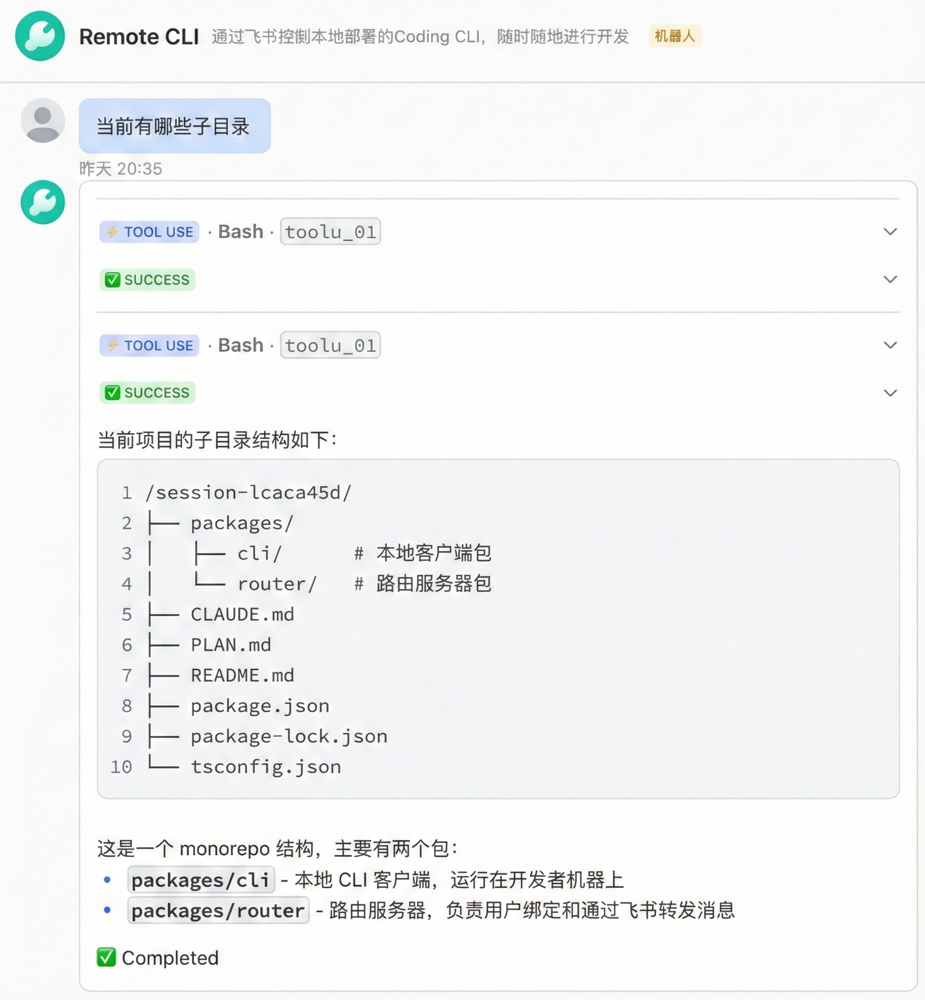

# Remote CLI - Control Claude Code / AGY CLI / Codex CLI / OpenCode CLI / Kimi Code CLI / ZCode / Pi from Mobile via Feishu

[](https://www.npmjs.com/package/@yu_robotics/remote-cli)
[](https://opensource.org/licenses/MIT)
[](https://nodejs.org/)

Remote control your Claude Code, AGY CLI (Antigravity), Codex CLI (OpenAI), OpenCode CLI, Kimi Code CLI, ZCode, or Pi from anywhere using your mobile phone through Feishu (Lark) messaging. Continue coding when away from your computer with a mobile-friendly interface.

[中文文档](README_ZH.md)

## Features

- 🌍 **Remote Control**: Control your local development environment from anywhere via mobile phone
- 🔒 **Controlled Access**: Working-directory selection controls and device authentication
- 📱 **Mobile-Optimized**: Simplified commands and rich text formatting for Feishu
- 📝 **Readable Code Changes**: Edit operations show collapsible, line-aware diff previews inside the existing progress card
- 🤖 **Multi-backend Support**: Supports Claude Code (default), AGY CLI (Antigravity), Codex CLI (OpenAI), OpenCode CLI, Kimi Code CLI, ZCode, and Pi, switchable at any time
- 🧵 **Multi-session Management**: Create multiple independent chat threads to handle different tasks in parallel. Support switching and creating threads via Feishu card buttons.
- 🖥️ **Remote Machine Management**: Control remote servers or Docker containers via SSH directly through Feishu. Support `/search`, `/view`, `/replace` and other remote file operations.
- ⚡ **Persistent Process**: Long-running AI process with bidirectional streaming via stdio for faster response times
- 📂 **Working Directory Controls**: Threads can select only explicitly allowed local working directories
- 🚀 **Easy Setup**: One-command installation and initialization, supports background daemon mode (`-d`)

### Execution Metadata

From CLI and Router 1.6.132, the final AI reply card shows a compact gray model and effort note below Completed and above the thread buttons. Backend-reported values take precedence; unconfirmed selections are marked `(configured)`, unset selections show `backend default`, and unavailable information shows `unknown`. A model identifier may be an alias and does not verify a proxy's underlying model identity.

The note describes the final execution or synthesis turn, not a later thread preference or every internal call. Earlier continuation pages keep their continuation notice. Local control commands do not receive model attribution. Metadata is sampled from cached executor state without extra API/model requests and retained for terminal reconnect recovery. This is additive protocol-v1 metadata: old CLI/Router combinations still work, but both sides need this release to show the note.

From CLI and Router 1.6.133, each managed delegated worker also shows its own model and effort in the visible metadata area above its collapsed activity details, using the same gray style. Values belong to that worker's execution attempt, never the coordinator. Existing backend events can refine the note while the worker runs; retained terminal task results keep the final snapshot after process cleanup. Queued or unstarted tasks have no execution attribution. No extra model requests are made, and older peers retain their existing behavior.

### Usage Examples

<table>
  <tr>
    <td></td>
  </tr>
</table>

## Recommended Use Cases

### 🦞 Scenario 1: Remotely Fixing a Broken openclaw Config (Real World Example)

**Target Users**: [openclaw](https://github.com/openclaw/openclaw) users and heavy users of any self-modifying CLI tool

**Background**: [openclaw](https://github.com/openclaw/openclaw) is a self-hosted personal AI assistant that can sometimes corrupt its own config files during execution, causing it to fail to start. Previously, you'd have to sit down at your computer to diagnose and fix it manually. Now you just open Feishu from wherever you are:

```
You:  /cd ~/projects/.openclaw
      The config is broken again, please fix it

Bot:  📂 Switched to ~/projects/.openclaw
      🔍 Checking config files...
      🔧 Reading config.json...
      ✅ Found the issue: `apiEndpoints` field was written with an
         illegal null value
      📝 Restoring defaults and fixing the format...
      🧪 Validating config...passed
      ✅ Config fixed — openclaw can start normally now
```

You only need to send one message from your phone. Claude Code, AGY CLI, Codex CLI, OpenCode CLI, Kimi Code CLI, ZCode, or Pi handles the investigation, fix, and validation autonomously on your computer.

**This pattern applies broadly**:
- Emergency recovery when any CLI tool corrupts its own config
- Remote diagnosis of service crashes, config conflicts, or missing environment variables
- No IDE needed — one Feishu message and the AI handles it for you

### Scenario 2: Enterprise Teams (Intranet Deployment)

**Target Users**: Development teams with a unified Feishu organization

**Deployment**:
- Deploy a router server on the company intranet
- Team members install the CLI client on their local machines
- Provide unified service through the Feishu bot

**Advantages**:
- 🔒 **Secure**: Only Feishu external communication is needed; the router server and clients are within the internal network
- 🏢 **Centralized Management**: One Feishu bot serves the entire organization, with administrators managing centrally
- 💰 **Cost-Effective**: A single low-configuration server can support the whole team
- 🔐 **Device Isolation**: Each member can only control their own computer, with no access to others' devices

### Scenario 3: Individual Developers (Home Intranet)

**Target Users**: Independent developers, freelancers

**Deployment**:
- Deploy the router server on your home intranet (e.g., NAS, Raspberry Pi, or spare computer)
- Run the CLI client on your local development machine
- Provide service externally through Feishu

**Advantages**:
- 🏠 **Zero Public Exposure**: The router server doesn't need a public IP; it communicates via Feishu long connection
- 📱 **Access Anywhere**: Control your home computer from your phone via Feishu when you're out
- 💡 **Development Convenience**: Continue programming, check logs, and fix issues when temporarily away from your computer
- 🆓 **Completely Free**: No need to purchase cloud servers; utilize existing equipment

## Architecture

```
┌─────────────────┐         ┌──────────────────────────────┐
│  Feishu Server  │         │  Developer A's Work PC       │
│                 │         │  (Mac/Linux)                 │
│  Developer A's  │◀───────▶│  ┌─────────────────────────┐ │
│  Phone          │         │  │  remote-cli (local)     │ │
│  Private Chat   │         │  │  - WebSocket Client     │ │
│  with Bot       │         │  │  - AI CLI Executor      │ │
└─────────────────┘         │  │    (Claude/AGY/Codex/OpenCode/Kimi/ZCode/Pi)   │ │
        │                   │  │  - Security Directory   │ │
        │                   │  │    Guard                │ │
        │                   │  └──────────┬──────────────┘ │
        │                   │             ▼                 │
        │                   │  Claude Code / AGY / Codex / OpenCode / Kimi / ZCode / Pi  │
        ▼                   │  (Local AI Backend)           │
┌─────────────────┐         └──────────────────────────────┘
│  Router Server  │
│  (Team Deploy)  │         ┌──────────────────────────────┐
│  ┌───────────┐  │         │  Developer B's Work PC       │
│  │ Feishu WS │  │         │  ┌─────────────────────────┐ │
│  │ Handler   │  │◀───────▶│  │  remote-cli (local)     │ │
│  └───────────┘  │         │  └─────────────────────────┘ │
│  ┌───────────┐  │         └──────────────────────────────┘
│  │WebSocket  │  │
│  │   Hub     │  │
│  └───────────┘  │
│  ┌───────────┐  │
│  │  Binding  │  │
│  │  Registry │  │
│  └───────────┘  │
└─────────────────┘
```

## Quick Start

```bash
# Install the CLI
npm install -g @yu_robotics/remote-cli

# Initialize and get binding code
remote-cli init --server https://your-router-server.com

# Add allowed directories
remote-cli config add-dir ~/projects

# Start the service
remote-cli start

# Install automatic startup for macOS or Linux
remote-cli service install

# Now send the binding code to your Feishu bot
# And start coding from your phone!
```

## Prerequisites

Before you begin, ensure you have:

- **Node.js** >= 18.0.0
- **npm** or **yarn** package manager
- **Claude Code CLI**, **AGY CLI** (Antigravity), **Codex CLI** (OpenAI), **OpenCode CLI**, **Kimi Code CLI**, **ZCode**, or **Pi** — at least one installed and configured
- Access to a **Feishu (Lark) bot** (your team should deploy a router server)

### Automatic Client Startup

After initialization, install a user-level startup service on macOS or Linux:

```bash
remote-cli service install
remote-cli service stop
remote-cli service start
remote-cli service status
remote-cli service uninstall
```

The installer captures the current Node.js executable, CLI entry point, `HOME`, `PATH`, and log paths. macOS uses a `LaunchAgent`; Linux uses a `systemd --user` service. `remote-cli stop` also stops an active managed service, while `remote-cli service stop` and `remote-cli service start` pause and resume it without removing automatic startup. The service runs as the current user, not root, so backend credentials and project access remain consistent with manual startup. On Linux, it starts after user login by default. To start it before login after reboot, enable user lingering explicitly with `loginctl enable-linger "$USER"`.

Both manual and non-interactive clients automatically install a newer Router's exact version from npm on startup or reconnection. The client waits until all threads and confirmed queues are idle. New commands received during the short installation window are rejected with a retry message. Manual starts keep the current process running after installation: the terminal reports the installed and running versions, and the update takes effect the next time you start remote-cli. Reconnecting alone does not activate the installed update. Non-interactive clients exit after installation so their process supervisor can restart them immediately; `--non-interactive` is intended for systemd or a macOS LaunchAgent, and manually using that flag also enables exit-after-update behavior. If npm installation or version verification fails, the existing process keeps running and retries later, with an exact-version command for manual recovery. If the Router rejects the running CLI protocol, a manual client must be restarted after installation before it can connect again.

When the Router restarts or its WebSocket connection drops, running backend processes continue. With CLI and Router 1.6.55 or newer, the CLI reconnects and resumes each task on a usable surviving card, or creates a new recovery card if the old card is missing or already finalizing. The Router acknowledges recovery only after a card is available; terminal recovery is acknowledged only after its result is delivered. Retained content, the output-gap notice, and resumed text are separate components. Output during disconnection or recovery is discarded, not buffered or replayed. The first resumed text segment uses plain text until a tool or image boundary so a partial code fence or table cannot consume the notice or later content.

Recovery requests are serialized. Each request waits up to 15 seconds for acknowledgement; failure triggers exponential backoff starting at 30 seconds and capped at five minutes. Incoming output cannot bypass that wait. After 20 consecutive failures, recovery for that task pauses for the current connection, while later output remains suppressed. Successful recovery resets the failure count, and a new connection starts another recovery round. Other tasks can recover once the paused task is skipped.

Router 1.6.92 also requires a successful recovery-notice update before acknowledging reuse of a surviving card. Failed updates remain retryable within the same recovery round without duplicating the notice. Card-update failures log the root reply ID, affected card ID and number, and Feishu error and trace codes without logging the card body. This requires only a Router upgrade and works with older recovery-capable CLIs.

Tasks that finish offline report only their completion or failure status. The CLI retains at most 100 terminal records for up to 24 hours, in memory; restarting the CLI discards them. A graceful Router stop marks unfinished reply cards as interrupted while backend tasks continue. Automatic updates wait for pending results to be acknowledged, expire, or exhaust their recovery budget; paused records do not block an update. Older Router versions keep their previous reconnect behavior.

After upgrading from version 1.6.23 or earlier on Linux, run `remote-cli service install` again to regenerate the systemd unit with corrected path escaping.

### Maintenance Notices

CLI and Router 1.6.123 add independent maintenance cards. First adoption silently records the currently running CLI version: it does not send a notice or replay historical changelogs. Later successful starts on a newer version show the bundled release notes for `(notification baseline, running version]`, combining skipped/offline upgrades into one range. Installation, `--version`, reconnection, reinstall, and downgrade alone do not trigger a notice. Downgrades preserve the notification baseline.

Release notes are bundled at build time from `CHANGELOG.md` and `RELEASE_NOTES_ZH.md`, starting with this feature's introduction; older history need not be reconstructed. The CLI build requires nonempty technical and user-summary entries for the current release. Historical entries without user summaries retain the legacy per-version display. Cards show compact version transitions, concise user summaries, collapsed technical details, and **View more** on longer ranges. Missing notes are reported separately from display paging; no online changelog fetch, Git command, or model summary is used.

From CLI and Router 1.6.127, upgrade notices use concise Chinese summaries from `RELEASE_NOTES_ZH.md`, with one short title and bounded user-visible changes per release. `CHANGELOG.md` remains the English technical record. The CLI build requires matching current-version entries in both documents and bundles both, without online translation or model calls. New Routers show summaries directly and collapse technical details. Earlier maintenance-capable Routers show the summary in their existing collapsed panels; new Routers keep older CLI notes collapsed when no technical-details field is present. Cumulative ranges, silent first adoption, delivery acknowledgements, and protocol version 1 are unchanged.

From CLI and Router 1.6.128, upgrade cards group changes by stable feature tags across each device's full pending version range, not just the current detail page. Exact duplicate items are removed within a feature; distinct changes remain available in paged version records. Feature tags are stripped from display Markdown and never shown to users. The overview is bounded to 6 KiB, six features, and 12 items, with explicit omission counts; all bundled summaries and technical records remain in collapsed version details. Older metadata or insufficient overview space falls back to the existing per-version display. The optional overview preserves protocol version 1 and old-peer behavior, without model calls or changes to first adoption, notification progress, or acknowledgements.

CLI and Router 1.6.134 consolidate the available 1.6.90-1.6.133 release records and confirmed source history into one stage summary. Upgrade notices for devices with an existing notification baseline show that complete summary, not an exact per-device subset; some changes may have been delivered before. The old version sections in this range are no longer bundled or available through package-backed detail paging, but remain in Git history. Earlier changelog records are unchanged, first adoption stays silent, and subsequent releases resume normal incremental entries. From 1.6.134, each release may contain one to six summary bullets within the unchanged 2 KiB budget. This release changes release documents, package versions, and summary validation only; backend execution and Router behavior are unchanged.

Delivery requires negotiated capabilities and the original device binding. Pending notices remain local until the Router acknowledges a successful card delivery and durable receipt. Receipts are private, bounded to 1,000 entries and 30 days. Deduplication is best effort: a crash between Feishu delivery and receipt persistence, or receipt expiry, can produce a duplicate. Maintenance cards never select a thread or change task/reply routing. Old peers retain normal messaging; an old Router leaves notices pending.

The CLI also checks enabled backend subscription adapters at startup and every hour. Only Codex is implemented; other backend slots do not start processes or call providers. A separate status-only Codex process uses existing file-backed ChatGPT credentials ephemerally, without inheriting user Codex/project configuration or API-key/custom-provider environment variables. It never refreshes or writes credentials, creates a thread, or sends a model prompt. Missing/expired credentials, keyring-only login, an unsupported native API, and failed probes are unavailable evidence, not zero usage. Normal `/status` behavior is unchanged.

The probe uses an experimental, unstable app-server login API to supply the locally stored token only in memory. OpenAI may change or remove this API; inspection then becomes unavailable without a model fallback or an interruption to normal messaging. Reverify native API compatibility when updating the supported Codex version.

Codex reminders use a conservative heuristic: two independent observations, 58-62 minutes apart, must both show zero weekly usage and approximately seven days remaining (within two minutes). The absolute reset deadline must advance by the actual sample interval, within two minutes; merely seeing 100% available twice or a later deadline is insufficient. This is notification eligibility, not a confirmed provider activation or reset policy. Observations and raw account identity stay in process memory; startup needs a new two-sample baseline. Acknowledged delivery suppression is persisted as described below.

Cards use backend-specific explanations. Codex shows **Weekly quota reset: 100%** and says: "Without new Codex usage, the reset countdown may keep moving forward. Send Codex a normal task to start the next usage window." The guidance explains why to use Codex and how, without verification steps. Availability is a snapshot from the qualifying checks, not a live balance, a claim that a reset just occurred, or a guarantee that one request starts a usage window. New reminder cards have no buttons; delivery acknowledgements suppress repeats while the condition persists. Legacy Dismiss callbacks remain passive. There is no Send Hi button or automatic activation, and neither inspection nor reminder actions send model requests. Legacy reminders without a backend identifier retain Codex handling; unsupported backend identifiers are rejected instead of inheriting Codex wording.

From Router 1.6.125, quota reminder cards use the title **🎯 Codex Reset** and summary **Weekly quota reset: 100%**, without the sampling-disclaimer footer. From Router 1.6.126, new quota cards have no buttons; validated legacy Dismiss callbacks remain passive. Normal-task guidance and inspection criteria are unchanged.

From CLI 1.6.126, acknowledged quota-reminder suppression survives upgrades and restarts in a private local ledger under `~/.remote-cli/subscription-reminders/`, scoped to the Router and device. It stores only hashed account/bucket fingerprints, not tokens, raw account identifiers, credential metadata, reset timestamps, or quota observations. Credential refreshes do not clear suppression; only a valid non-candidate observation rearms that account. Missing/failed probes retain suppression. Sampling baselines remain in memory. Accepted acknowledgement writes finish before graceful shutdown; corrupt, unsafe, or unavailable storage pauses quota inspection and reminder delivery without erasing the ledger or affecting normal messaging.

Deduplication is not exactly once: a crash between card delivery and local acknowledgement persistence can still produce a duplicate. Earlier clients retain process-only suppression, and their delivery history cannot be recovered on first adoption of the ledger; one additional qualifying reminder is possible. The Router presentation change alone does not give an older CLI restart-safe suppression.

Both features default to enabled. To opt out locally, run either command and restart the CLI:

```bash
remote-cli config set maintenance.updateNotice false
remote-cli config set maintenance.subscriptionInspection false
```

### Backend Executable Discovery

CLI 1.6.119 enriches its own `PATH` at startup on Linux and macOS before backend checks or child processes. Inherited entries keep their precedence, followed by the running Node directory, a verified npm global installation bin, conventional user bins (`~/.local/bin`, `~/.kimi-code/bin`, `~/.npm-global/bin`, `~/.bun/bin`, `~/.opencode/bin`), and platform system/Homebrew bins. Directories need not exist yet: installing a backend there later can be detected by a fresh `/backend`; delegation discovery retains its existing 30-second cache.

Upgrade and restart the CLI process once to activate this behavior; reconnecting alone does not activate an installed update in an old running process. Valid existing systemd units and LaunchAgents do not need reinstallation and are never rewritten automatically. New service installations use the same PATH builder. A removed Node executable or broken CLI `ExecStart` path still requires repairing the service. Upgrading only the Router does not fix an old client's PATH; the wire protocol and existing compatibility requirements are unchanged.

Startup does not source shell profiles, invoke npm to discover prefixes, scan runtime versions, install tools, or newly add version-manager shims. Already inherited shim directories stay unchanged. For custom installation locations, set `executor.<backend>.command` to an absolute executable path, preferably the real binary. Startup checks, `/backend`, delegation, and auxiliary Claude queries honor that setting without silently substituting another executable. ZCode retains its native unset/empty-command lookup behavior; a nonempty invalid override does not fall back. A successful version probe does not prove authentication or remaining quota.

## Router Server Deployment

> **Note**: Most users don't need to deploy the router server. Your team administrator should deploy one router server for the entire team to share.

The router server forwards messages between Feishu and local CLI clients.

### Prerequisites

- A server with at least **1 CPU core** and **1GB RAM**
- **Node.js** >= 18.0.0
- **Domain name** and SSL certificate (for public deployment with HTTPS)
- A **Feishu bot** created and configured

### Install Router Server

```bash
# Install from npm (recommended)
npm install -g @yu_robotics/remote-cli-router

# Or install from source
git clone <repository-url>
cd remote-cli
npm install
npm run build -w @yu_robotics/remote-cli-router
cd packages/router
npm link
```

### Configure Router Server

```bash
remote-cli-router config
```

You will be prompted for:
- **Feishu App ID** (required)
- **Feishu App Secret** (required)
- Feishu Encrypt Key (optional)
- Feishu Verification Token (optional)
- Server Port (default: 3000)

### Setup Feishu Bot

1. Go to [Feishu Open Platform](https://open.feishu.cn/)
2. Create a new app
3. Enable **Bot** capabilities
4. Configure permissions:
   | Permission | Description | API Scope |
   |------------|-------------|-----------|
   | 获取与发送单聊、群组消息 | Get and send single/group messages | `im:message` |
   | 读取用户发给机器人的单聊消息 | Read user's private messages to bot | `im:message.p2p_msg:readonly` |
   | 以应用的身份发消息 | Send messages as bot | `im:message:send_as_bot` |
   | Get and upload image or file resources | Upload images for response cards | `im:resource` |
5. Enable **Long Connection** in Event & Callback section
6. Subscribe to event: `im.message.receive_v1` ([Receive Message v2.0](https://open.feishu.cn/document/uAjLw4CM/ukTMukTMukTM/reference/im-v1/message/events/receive))
7. Enable message card callback: `card.action.trigger` (for interactive card buttons)
8. Get credentials (App ID, App Secret) and publish the app

### Start Router Server

```bash
# Start the service
remote-cli-router start

# Or use PM2 for production
pm2 start remote-cli-router --name router -- start
```

### Docker Compose Deployment (Recommended for Shared Routers)

Docker is recommended for the shared Router server because it keeps Node.js and Router dependencies isolated. The local client should not normally run in Docker: it needs direct access to local project files and the installed Claude Code, AGY, Codex, OpenCode, Kimi Code CLI, ZCode, or Pi binaries.

```bash
# From the repository root
docker compose build

# Optional: choose a host/container port before setup
cp .env.example .env
# Edit ROUTER_PORT if 3000 is already in use. On Linux, also set
# ROUTER_UID=$(id -u) and ROUTER_GID=$(id -g) in .env.

# Create the bind-mounted directory as the current user
mkdir -p router-data

# Configure Feishu credentials interactively and persist them in ./router-data
docker compose run --rm router config setup

# Start the Router in the background
docker compose up -d
```

The setup wizard stores configuration and bindings in `./router-data`, so they survive container recreation. Compose runs the container with `ROUTER_UID` and `ROUTER_GID`; these values must match the owner of `./router-data` to avoid bind-mount permission errors. `ROUTER_PORT` controls both the host port and the Router's container port, and must match the port entered during setup. The Compose service uses `restart: always`, so Docker starts the Router again after unexpected exits and Docker daemon restarts. An explicit `docker compose down` still removes the container. Router logs are available with `docker compose logs -f router`; stop it with `docker compose down`. Open the configured port only to the trusted internal network, or place the Router behind an HTTPS reverse proxy for public access.

### Nginx Configuration (Production)

If using a domain with HTTPS, configure Nginx as a reverse proxy:

```nginx
server {
    listen 443 ssl http2;
    server_name your-domain.com;

    ssl_certificate /path/to/ssl/cert.pem;
    ssl_certificate_key /path/to/ssl/key.pem;

    location / {
        proxy_pass http://localhost:3000;
        proxy_http_version 1.1;
        proxy_set_header Upgrade $http_upgrade;
        proxy_set_header Connection 'upgrade';
        proxy_set_header Host $host;
        proxy_cache_bypass $http_upgrade;
    }

    location /ws {
        proxy_pass http://localhost:3000;
        proxy_http_version 1.1;
        proxy_set_header Upgrade $http_upgrade;
        proxy_set_header Connection "Upgrade";
        proxy_set_header Host $host;
        proxy_read_timeout 86400;
    }
}
```

### Client Server Address Guide

When initializing the client, you need to specify the router server address. The address format depends on your deployment method:

| Deployment | Server Address Example | Description |
|-----------|----------------------|-------------|
| **Local/Intranet** | `http://127.0.0.1:3000` | Router and client on same machine |
| **LAN** | `http://192.168.1.100:3000` | Use internal IP + port |
| **Public** | `https://your-domain.com` | Use domain with HTTPS |

**Initialization examples:**

```bash
# Local deployment
remote-cli init --server http://127.0.0.1:3000

# LAN deployment
remote-cli init --server http://192.168.1.100:3000

# Public deployment
remote-cli init --server https://your-domain.com
```

## Installation

### From npm (Recommended)

```bash
npm install -g @yu_robotics/remote-cli
```

Or using yarn:

```bash
yarn global add @yu_robotics/remote-cli
```

### From Source

```bash
# Clone the repository (replace with actual repository URL)
git clone <repository-url>
cd remote-cli

# Install dependencies
npm install

# Build all packages
npm run build

# Link the CLI globally
cd packages/cli
npm link
```

## Usage

### 1. Initialize

Generate a unique device ID and binding code:

```bash
remote-cli init --server https://your-router-server.com
```

Example output:
```
✔ Initializing remote CLI...
✔ Device ID: dev_darwin_a1b2c3d4e5f6
✔ Binding code: ABC-123-XYZ

Please bind your device in Feishu:
1. Open Feishu and find the bot
2. Send: /bind ABC-123-XYZ
3. Wait for confirmation

Binding code expires in 5 minutes.
```

### 2. Bind Device in Feishu

Open your Feishu app and send the binding code to the bot:

```
/bind ABC-123-XYZ
```

### 3. Configure Security

Add allowed directories where Claude Code can operate:

```bash
# Add a single directory
remote-cli config add-dir ~/projects

# Add multiple directories
remote-cli config add-dir ~/work ~/code/company-repos

# View current configuration
remote-cli config show
```

### 4. Start Service

```bash
remote-cli start
```

### 5. Check Status

```bash
remote-cli status
```

### 6. Stop Service

```bash
remote-cli stop
```

## Slash Commands

Once connected, use these commands in Feishu:

### Core Management

| Command | Description |
|---------|-------------|
| `/help` | Show help information |
| `/status` | Show backend, model, effort, delegation, queue, and thread status |
| `/context` | Show current session context and queue diagnostics |
| `/skills` | List available skills for the active backend |
| `/abort` | Abort the currently executing task in this thread |
| `/queue` | Inspect or manage confirmed messages waiting in thread queues |
| `/clear` | Clear conversation context for this thread |
| `/new` | Alias for `/clear`; start a fresh conversation in this thread |
| `/compact` | Compress conversation history to save tokens |
| `/delegation [on|off|reset [backend]]` | Inspect, enable, disable, or reset isolated delegated worker context in the current thread |
| `/model [name]` | List models for the active backend or set this thread's model |
| `/effort [auto|level]` | Show or set per-thread reasoning effort for Codex/AGY/OpenCode/Kimi/ZCode/Pi/DSH |
| `/sandbox [on/off/read-only/default]` | Show or configure the current Codex or Claude Code thread sandbox; use `allow/remove <directory>` and `network on/off` for access settings |
| `/cd <dir>` | Change directory; a different directory starts fresh conversations for this thread |
| `/backend` | List backends and show the current thread's effective backend |
| `/bind <码>` | Bind a new device |
| `/unbind` | Unbind all devices |
| `/device` | List bound devices with connection status, or switch devices |

### Cross-backend Delegation

Claude Code, Codex, Pi, AGY, OpenCode, Kimi Code, ZCode, and DSH can each coordinate
independent tasks on other installed backends. From CLI 1.6.95, managed
same-backend delegation is rejected before a worker starts, and discovery marks
the current backend unavailable as a worker. Use the current backend directly
or its native subagents, if supported. Keep talking to your existing thread;
its selected backend collects worker results and answers you. Workers do not
create extra thread buttons.

```text
/delegation
/delegation on
Ask Pi to inspect the relevant files, ask Codex to implement the agreed fix,
then ask Claude Code to review it. Check a result when useful, or return after
dispatch and let Remote CLI wait and resume the coordinator automatically.
/delegation off
/delegation reset
/delegation reset codex
```

From CLI 1.6.121, delegation is **on by default** for new and existing threads
without a saved preference. A saved `false` remains off; `/delegation off`
explicitly opts out and `/delegation on` enables it again. No historical thread
migration or conversation reset is required. The preference survives backend
switches, conversation resets, and CLI restarts. Default-on makes delegation
tools available; it does not automatically start workers. Explicitly disabled
threads skip managed tools, prompt changes, and delegation admission checks.
Install, authenticate, and select a working model for each desired backend
first. Discovery checks its configured executable; authentication and remaining
quota are checked only when a task runs. Upgrade and restart the local CLI to
obtain the new default. Existing Routers remain compatible; upgrading only the
Router leaves an older CLI's default unchanged.

When enabled, each `(parent thread, worker backend, workspace generation)` owns
isolated worker conversations. Non-Git workspaces retain one serial lane; Git
workspaces can pool multiple lanes for concurrent tasks, each with its own
reusable worktree directory. No lane reuses the parent's direct conversation.
A worker process stops after every task and must confirm exit before reuse.
The parent's saved model and reasoning effort apply whenever a worker starts.

From CLI 1.6.130, Git workers use detached task checkouts under private local
storage. Each task starts from a bounded snapshot of the delivery repository,
including staged, unstaged, and nonignored untracked changes without changing
the user's index. All accepted tasks in a cohort share that baseline; after
artifact integration, the next task captures the updated delivery workspace.
Earlier conversation context may be stale, so workers are told to re-read files.
Private `refs/remote-cli/*` keep input and output checkpoints outside normal
branches and tags; do not publish these refs or use a mirror push. Snapshots are
limited to 10,000 files and 128 MiB. Existing conflicts, submodules, unsafe links,
known untracked credential files, and broken Git metadata stop setup rather
than falling back to shared parallel writes. The whole repository must be
within the directory-selection policy; allowing only a subdirectory is not
enough. Unsupported repositories fail delegation setup, not ordinary backend
execution. Standard Git configuration, including clean filters, still runs;
limits also validate the actual resulting tree. Integration patch output is
bounded to 32 MiB. Larger patches require manual integration. Ignored files,
dependencies, and local environment files are not copied; prepare dependencies
inside a worker checkout when its task needs them.

Task success does not merge files. After all accepted workers finish, the
coordinator uses `remote_cli_integrate` to inspect an owned artifact and its
delivery revision, then explicitly apply or retain it. Apply requires the exact
revision, checks conflicts in a separate integration worktree, and changes
working files without staging, committing, or pushing. Conflicts leave the
delivery directory untouched and report a preserved recovery directory.
Before applying files, private recovery refs preserve both the current working
tree and the intended result. An interrupted or failed application may have
changed files: inspection exposes those refs and blocks automatic reapplication
until manual recovery or explicit retention. Verify working and staged changes
with `git status` before delivery; application does not update the index.
Changes outside the selected subdirectory and failed/cancelled partial output
require manual recovery or explicit retention. Retain declines integration but
keeps the immutable artifact; it does not delete files. No-change tasks need no
integration. Pending artifacts and unknown dirty files prevent lane reuse.
Before a reusable lane starts again, its checkout moves to a fresh baseline,
including integrated sibling changes, while its native conversation continues.
Artifacts and recovery files are retained beyond diagnostic expiry and native
conversation reset/deletion; clean them manually only after confirming delivery.
A worktree isolates checkout files, not OS permissions, Git configuration,
external tools, or access to other directories. Git is never initialized
implicitly for a non-Git directory.

`/status` shows `Delegation: on/off (current thread)` for the thread receiving
the command. Reading this setting does not initialize delegation or start workers.

CLI 1.6.94 and newer show each finished worker as a result block in the existing
reply card, with a colored status label, backend name, short task description,
and elapsed time. Failed, timed-out, cancelled, and interrupted tasks include a
bounded reason; the coordinator still receives the existing task result. This
uses the existing text stream and works with older Routers. It adds no probes,
cooldowns, retries, or changes to ordinary non-delegated sessions.

CLI and Router 1.6.103 and newer show tool progress in a nested worker panel.
With CLI and Router 1.6.106 and newer, the panel uses the latest bounded
assistant response text as its current activity, shows a concurrently active
tool separately, and includes elapsed time and the last real tool activity. A
display update is flushed before a following tool event so a brief update is
not lost. CLI and Router 1.6.107 and newer present that response as a primary
two-line activity block, with the active tool and timing shown as secondary
information. It refreshes elapsed time at a low frequency while the worker
remains active. Raw tool output and reasoning are excluded from latest-text
snapshots; assistant response text is escaped and bounded. Text snapshots never
extend worker liveness timeouts. The latest-text capability is negotiated
separately: peers without it keep tool-only nested progress, while peers without
nested progress keep the existing start and terminal-result blocks.

Router 1.6.108 and newer render the bounded final worker result as Markdown
inside the existing collapsed panel, preserving headings, paragraphs, emphasis,
lists, links, and code blocks. Worker-supplied HTML and Feishu tags are displayed
literally; links are limited to HTTP, HTTPS, and email, and images become captions.
The result remains a bounded preview, and cut code fences are closed for display.
This rendering change requires only the Router upgrade and no protocol changes.

Router 1.6.109 also renders Current activity as bounded Markdown, separate from
tool and timing metadata, and labels Recent activity with a clipboard icon.
CLI 1.6.109 includes unfinished sentences and lines in its latest assistant-text
snapshots, coalesced at the existing 2.5-second cadence instead of waiting for
a completed sentence. Only actual assistant response text appears; waiting for
the backend to emit text still shows a fallback, and snapshots do not extend
worker liveness timeouts. The Markdown and icon updates require the Router;
the unfinished-text update requires the CLI. The wire protocol is unchanged.
The CLI also prefixes the result-arrival notice with a puzzle piece emoji (🧩).

Router 1.6.111 keeps each worker's purple robot icon, compact backend name,
number, and status on one header row on mobile, without a duplicate AI badge.
Tool-only activity shows the tool directly; timing stays concise, and detailed
tool timing remains inside the activity fold. Latest updates, result excerpts,
failure reasons, and input requests
stay visible; only activity details default to collapsed. Tool start/result
events share one log entry, and tool issue counts remain visible even after
older entries leave the bounded log. The last-update indicator includes actual
text and tool events, never timer refreshes. Missing terminal output retains
the last activity with an explicit non-result label.

The same safe Markdown renderer handles activity, results, and prompts, including
small tables. Tables share the existing whole-card budget; cut or oversized
tables fall back to readable text without adding missing data. Activity previews
retain the latest words, including the full negotiated text snapshot. Result
excerpts remain bounded, not full transcripts. These presentation changes need
only the Router upgrade, with no new CLI payloads or formatting instructions;
older clients retain their negotiated tool-only or legacy progress behavior.

CLI 1.6.111 excludes protocol-tagged thoughts from ordinary streaming text,
final output, and delegated result summaries for Kimi Code, OpenCode, and ZCode.
ZCode uses its native app-server adapter, not ACP on the wire. Existing model
thinking and effort settings are unchanged; ordinary response text,
permission prompts, questions, images, plans, and tool events remain available.
This requires a CLI upgrade and does not change the wire protocol. Codex
reasoning summaries, Claude's legacy thinking events, and tool-update deduplication
are separate behaviors and are unchanged by this release.

Use `/delegation off` for threads that should keep ordinary execution without
managed tool registration, prompt prefixes, or delegation workspace admission
checks. Their ordinary process handling and session output remain unchanged,
apart from removing previously owned tools. Disabling an implicit default
before any tools have been registered does not reconfigure unused native
sessions.

After a thread has used delegation, `/delegation off` removes its managed tools.
The CLI records which backends need cleanup, including after a restart or a
backend switch. Cleanup also runs before native slash commands can resume such a
session. Removing tools may recycle that backend process once per executor
instance; it preserves the saved conversation and does not repeatedly restart
an already cleaned process. Backends never used for delegation skip this cleanup.

`/clear`, `/new`, backend switches, and toggling `/delegation` leave worker
lanes intact. `/cd` starts a new workspace generation and discards the old
lanes. `/delegation reset` discards every lane in the current thread, while
`/delegation reset <backend>` discards only that backend's lane. Reset and
working-directory changes are refused while a delegated worker is active;
`/thread delete` removes all of that thread's worker lanes.
If lane cleanup fails, reset or thread deletion reports an error and retains the
pending lane record for retry. The CLI retries explicitly pending cleanup on
startup; it does not automatically delete a lane from a worker whose process
exit could not be confirmed. Check that the worker has stopped before retrying
cleanup in that case.
If cleanup fails after `/cd`, the directory change still succeeds and the
response reports the pending lane cleanup separately.

The shared Router can be upgraded before local CLIs. This feature keeps protocol
version 1 and its existing command, tool-progress, and response formats. Older
CLIs continue their existing workflows; delegation requires upgrading the local
CLI and enabling it in that thread. CLI and Router package versions need not
match to connect. Optional approval cards, task recovery, and nested worker
progress remain negotiated per device, so newer and older CLIs can share one
Router.

The coordinator receives registered tools through MCP or an explicitly loaded
Pi extension. OpenCode and Kimi use ACP session MCP servers; ZCode uses its
native app-server session MCP servers. AGY uses an isolated per-thread MCP
configuration restored on opt-out, and inherits its bridge credentials only
through the process environment. No skill installation or global backend
configuration change is required. ZCode's session MCP override replaces custom
user-configured MCP servers while delegation is enabled; its native and plugin
tools remain available, and opt-out restores the normal MCP configuration.
Each worker receives a self-contained task,
uses the parent's working directory, and has an independent conversation. The
coordinator must include needed context; past messages and image attachments
are not copied automatically.

Worker progress appears as a task in the existing reply card. Results return
to the coordinator for its final answer. The CLI suppresses coordinator prose,
plans, and images while results are missing from the active execution; program-owned progress
and genuine approval/question prompts remain visible. If the coordinator returns
early, the CLI keeps the request busy, waits for terminal results, and resumes
the same coordinator session with those results before releasing the queue.
The original request and image attachments are not sent again. The combined
continuation data is capped at 64 KiB, preserving every task's identity and status;
individual results remain available through the result tool, subject to the
per-task limit below. A coordinator that
successfully processed every result finishes normally without an extra turn.

CLI 1.6.89 and newer retain results until the coordinator execution succeeds.
Existing model recovery and automatic compaction can retry a result continuation
if that execution accepted no new worker launch. The retry uses the same result
batch, without restarting completed workers or resending the original attachments.
If the reply still fails, the card includes bounded completed worker results as
plain text, alongside the failure. This fallback does not provide automatic
recovery on a later request or guarantee delivery across disconnects/restarts.

Child approvals and questions use the existing card/text input flow, tied to the
original user and worker. Worker approval cards omit Remember; configure persistent
grants on the real thread. `/abort`, CLI shutdown, and coordinator failure cancel
unfinished workers without automatic continuation. An execution that launched
a new worker is not replayed after failure. Abort and shutdown suppress the
failure-result fallback as well as further continuation.
Cancellation does not undo existing edits.

From CLI 1.6.131, there are at most five occupied starting/running worker slots per CLI.
From CLI 1.6.130, a Git-backed request can run multiple workers concurrently
in independent worktrees; further tasks report `queued` and start in FIFO order
as capacity becomes available. Non-Git directories still run one worker at a
time, enforced by the scheduler, not by a prompt. Each accepted task has its
own result and cancellation; failure or cancellation normally leaves siblings
runnable. A plain-text reply is refused when several workers need input; use
the specific approval card or request ID instead.
The cumulative limit is 12 accepted tasks across all coordinator continuations
of that request, including failures and cancellations. A queued task expires
one hour after admission without extending any other task's deadline. Queue
status uses existing notice text; a worker progress card starts only at actual
dispatch. The workspace remains reserved until the queue and active worker
are finished. Other requests with overlapping workspaces or no initial global
execution slot are rejected, not placed in a cross-request queue.
This local CLI change works with existing Routers and does not add peer messaging
or change native backend behavior. Sibling results are not explicitly forwarded;
a reused same-backend lane retains its own earlier task context. An uncertain
setup or cleanup retains its occupied global slot until the CLI restarts.
From CLI 1.6.100,
a task stops after 15 minutes without a worker tool callback. While one or more
worker tools are active, that callback-silence window is 45 minutes; it returns
to 15 minutes after all active tools report results. Only `tool_use` and
`tool_result` callbacks refresh these windows; text streaming does not. There is
no fixed total duration cap: continued tool callbacks let a worker continue, and
`/abort` remains available to stop a pathological task. From CLI 1.6.95,
intermediate text and tool-result volume does not abort workers; the delegation
manager does not retain those intermediate
outputs. Each returned result is limited to 32 KiB. Oversized result text keeps
its beginning and end, marks the omitted middle, and sets `truncated: true`
without changing the worker's success or failure status. Combined continuations
use the same truncation policy within their 64 KiB budget. These limits bound
retained delegation results, not the backend's own output buffers.
Other requests with overlapping source repositories are rejected. These
reservations restrict delegation-enabled threads and workers; opted-out ordinary
threads retain access to their workspace. They do not lock files against those
threads, native parallel tools, or external editors. Non-Git shared directories
must not be edited concurrently with a worker. Git workers must keep changes
inside their owned checkouts; explicit integration waits for every accepted
worker and revalidates delivery ownership. No peer messaging, recursive
delegation, automatic Git commit, or remote push is introduced.

Workers follow the coordinator's effective remote-cli sandbox policy. The default
`inherit` mode launches unrestricted workers when the coordinator has no sandbox,
even if the target backend has separate saved sandbox settings. This does not
change those saved settings or other backend approval options. For research
tasks, use `inherit` and put any no-write requirement in the objective; such an
instruction is not an enforced sandbox. Unrestricted coordinators can choose
installed, authenticated workers on a different backend, but cannot request
`read_only` to enable a new worker sandbox.

A sandboxed coordinator has no eligible managed workers in this release:
same-backend delegation is disabled, and cross-backend sandbox translation
remains deferred. Discovery reports `worker: false` with a reason, and launch
requests are rejected without weakening saved sandbox settings. `read_only`
remains a recognized compatibility value but is unavailable under this policy.
Native backend task/subagent tools are not changed by these managed delegation
rules; their availability depends on the backend.

All 42 different-backend combinations and seven same-backend rejections are
covered at the task-manager test boundary with mocked executors. Earlier live
model delegation verified the original Claude Code/Codex/Pi matrix before this
cross-backend-only policy.
The four additional adapters have protocol and lifecycle tests; ZCode also
passed live MCP tool registration. Their live model tests
were blocked by missing local authentication (AGY, OpenCode, Kimi) or an unset
model (ZCode), so those model combinations and native persisted-session
restoration remain unverified.

Router reconnection uses the existing parent task recovery and approval replay;
disconnected progress is not buffered. Restarting the CLI marks retained queued or running
task records interrupted and never automatically repeats them. Records under
`~/.remote-cli/delegation/` retain at most 200 completed tasks for seven days.
If worker shutdown cannot be confirmed, its workspace stays blocked for
subsequent delegation-enabled work until the worker is stopped and the CLI
restarts. Opted-out ordinary threads are not blocked by this reservation.
If the initial task record cannot be written, the CLI refuses to start the worker.
For Pi, an unconfirmed RPC exit also blocks a new Pi process from starting and
is reported in timeout or abort errors.

For Pi, `/clear` and `/new` reset the conversation without bypassing pending
process cleanup. A replacement session waits for all previous Pi processes
owned by that thread to exit. If cleanup fails, retry after the old process
has exited; repeating a context reset does not remove this protection.

### Multi-session (Threads)

Start multiple independent sessions simultaneously.

| Command | Description |
|---------|-------------|
| `/thread list` | List all threads and their status |
| `/thread new [name]` | Create a new session thread |
| `/thread delete <name>`| Delete an idle thread |

*Tip: Reply directly to a card message from a specific thread to continue the conversation in that thread.*

Streaming response cards and every continuation card keep their thread heading visible while text and tools are still arriving. With both CLI and Router 1.6.113 or newer, the CLI sends the actual thread name and working directory before backend output starts. A newly created card may briefly show `Resolving thread...` until the CLI confirms the context. This uses an optional negotiated capability: older peers remain compatible, but an older CLI may only supply the thread name in its final response.

### Backend Switching

Backend selection supports both global and per-thread modes:

| Command | Description |
|---------|-------------|
| `/backend` | List installed backends and show the current thread's effective backend |
| `/backend <index>` | Switch all threads to the selected backend and clear per-thread overrides |
| `/backend <index> @` | Switch only the current thread to the selected backend |
| `/backend default @` | Clear the current thread's override and follow the global backend |

The backend index follows the order shown by `/backend` (Claude Code, Codex CLI, OpenCode CLI, Kimi Code CLI, ZCode, Pi, then AGY CLI when installed). Per-thread backend choices are persisted in `threads.json`. Different threads can use different backends and execute concurrently. A backend switch is rejected while the affected thread is running; a global switch is rejected while any thread is running. Backend session data is preserved when switching, so returning to a backend can resume its previous session.

**AGY data separation (not a security boundary)**: agy normally stores all conversations in `~/.gemini/antigravity-cli`. remote-cli redirects each thread's default AGY data lookup to `~/.remote-cli/agy-homes/<threadId>` by changing the AGY process's `HOME`. Shared login, configuration, and program entries are linked from the real `~/.gemini`. AGY tools inherit the changed `HOME`, which can affect `cd ~`, Git/SSH configuration, caches, and scripts. Directory symlinks and the original HOME remain readable to processes with the same OS-user permissions; this does **not** prevent a tool from reading another thread's transcripts. Use a separate OS account or a real filesystem sandbox if untrusted threads require a read boundary. If AGY replaces a linked credential with a thread-local file, remote-cli keeps that file and does not overwrite the shared credential; reconcile login state manually if it diverges. Existing conversations are not copied automatically. Before upgrading a client with saved AGY sessions, stop that client and use SQLite's `.backup` command to copy each conversation database, then copy its `brain/<conversationId>` directory from the shared store into `~/.remote-cli/agy-homes/<threadId>/.gemini/antigravity-cli/`; the IDs are recorded in `~/.remote-cli/agy-sessions/<threadId>.json`. Preserve the shared store as a backup. If a saved database is missing from the thread HOME, AGY stops with a migration error instead of attempting to resume it; `/clear` starts a new conversation if the old one is no longer needed. Deleting a thread removes its AGY HOME and session pointer even when AGY is not the active backend. Other backends are unchanged.

### Command Queues

Each thread executes one command at a time because Claude Code, AGY, Codex, OpenCode, Kimi Code, ZCode, and Pi sessions are sequential. If a normal message is sent while its thread is busy, remote-cli shows a Feishu confirmation card instead of queueing it immediately. The message is queued only after clicking **Add to queue**; clicking **Cancel** or waiting for the confirmation to expire discards it.

With a CLI and Router that support queue-start notifications, confirming a message keeps a static queue receipt. When the task actually starts, a new execution card appears at the bottom of the chat with its thread, working directory, task preview, and remaining queue count. Progress and results stay on that new card, and the old receipt points to it. Older clients retain the waiting-card behavior. Queued work remains in memory; this does not make queues persistent across service restarts.

`/queue` lists active and pending queues. `/queue clear` removes confirmed and awaiting-confirmation messages for the current thread. `/abort` stops the current task and clears that thread's queue. A message sent while abort cleanup is still running waits for cleanup and then starts normally, so it is not discarded with the old task. Backend or execution-context changes are rejected while a thread is busy, and a successful backend switch clears affected queues. `/thread list` and `/thread new` are not blocked by a busy thread because they do not touch its execution context; the **+ New** card button therefore works even while the default thread is running. When the active task finishes, the first confirmed queued message starts even if the active task ended with a backend error such as model capacity. If a task that was taken from the queue fails, the remaining queue pauses; use `/queue continue` to resume or `/abort` to discard the remaining messages. Queues are in-memory and are discarded on service restart.

New messages cannot bypass confirmed work already waiting in a thread queue, even when the executor is idle. They require queue confirmation and join behind the existing work. If a queued task fails, its error card explicitly reports that the remaining queue is paused, with confirmed and awaiting-confirmation counts. Use `/queue continue` to resume in order, or `/queue clear` to discard pending work. A failure with nothing left waiting does not pause future messages. Queue positions count confirmed waiting messages, excluding the running task; the confirmation card shows the count before the new message is added.

### Code Change Previews

Code edits use one collapsible preview per file, with the file path and added/deleted line counts in the header. Deleted lines are explicitly red and added lines green through Feishu rich text, independent of native `diff` syntax highlighting. A copyable diff preview preserves original spaces, tabs, and code characters; rich-text indentation is for display only.

Previews retain three lines of context around each change. Display budgets are shared across files and hunks, with explicit notices for omitted lines, hunks, or files. A diff-only tool result is displayed even without a text message. Codex file-change events retain file boundaries, and ACP old/new text is compared so unchanged lines are not presented as replacements. Snippet-relative line numbers and Write content previews are labeled; Write does not imply a new file when its previous contents are unavailable.

This changes display only. It does not merge tool calls with their results or alter backend execution. The Router upgrade enables the new previews for existing diff data; upgrading the CLI also preserves file names in Codex multi-file changes. Pi and AGY edit payload mappings are unchanged.

### Background Task Notifications

Claude Code and Codex can send a standalone task card when a background task finishes, even after the original reply has completed. Both use the same completed, failed, and stopped card styles, show the originating thread, and let you reply to the card to continue that thread. Foreground commands stay in their original response; duplicate completion events do not create duplicate Codex task cards.

Router 1.6.117 and newer explicitly label standalone background-task notifications **Background task**. The status, originating thread name (or thread ID when no name is provided), and abbreviated task ID remain visible, while **View details** is collapsed by default and contains the rich Markdown result and optional output path. Failed tasks also show a short, literal failure summary outside the panel. This changes only the Router presentation: the CLI protocol, foreground replies, delegated-worker cards, and reply-to-thread routing remain unchanged.

Codex watches native command completion events and sub-agent terminal states. Command cards include the command, exit code when available, and an output excerpt; sub-agent cards use the reported result. It does not run another model turn to generate these cards. Native command notifications were verified with Codex 0.154.0; sub-agent event availability depends on the installed Codex version. Tracking lasts for the current executor process: clearing a conversation, switching its backend, or restarting/disconnecting the Codex process discards its watchers. This does not add durable background-task recovery or change AGY support.

### Image Input

You can send a standalone image or a rich-text message containing both text and images to the Feishu bot. remote-cli downloads the image resources and forwards the text and images together to the active Claude Persistent, Codex App Server, OpenCode ACP, Kimi Code ACP, ZCode app-server, or Pi RPC backend. AGY currently accepts text only and will not process image attachments. For ordinary documents, see [File Attachments](#file-attachments).

Codex App Server generated images are also forwarded back to Feishu. Codex emits the generated image through its app-server protocol; the CLI sends it to Router, Router uploads it to Feishu, and the image is rendered in the existing Card 2.0 response. This requires both CLI and Router versions with image forwarding support. Upgrading only Router is backward-compatible, but an older CLI will not generate or send image events; upgrading only CLI is also safe, but an older Router will ignore the optional image stream and still show the text response.

All backends can also send a local image generated during a task when the tool result or final response includes its path or a Markdown image link, such as `chart.png` or ``. The file must be inside an allowed working directory and no larger than 2 MiB. The CLI reads the file and reuses the same image stream; Router uploads it and renders it in the current Card 2.0 response. This path-based fallback is useful for charts and screenshots and does not require the backend to emit a native image event.

Image uploads require the bot application's `im:resource` permission; publish
the updated Feishu application permissions before retrying a denied upload.
Router 1.6.85 and newer display local and URL-based Markdown image references
as captions, while uploaded images use separate card image components. This
prevents file paths from being interpreted as Feishu image keys during streaming
or final rendering. Code examples and inline references to Feishu `img_` keys
are preserved. An older CLI without image forwarding can still show the caption.
Router 1.6.89 and newer recognize Markdown list and quote boundaries when
filtering image references, preserving actual fenced and indented code examples.

### File Attachments

File reception is **enabled by default on Router 1.6.114 or newer** and requires **CLI 1.6.113 or newer**, TLS, and explicit device enrollment. The Router default does not authorize an unenrolled CLI to download files.

1. Reuse the CLI's existing WSS Router address. The CLI derives the same-origin HTTPS download address automatically, and the Router sends only relative `/api/files/` paths; no separate public URL is needed. Expose `/api/files/` through the existing authenticated Router application, without proxy caching. HTTP is allowed only for local development on `localhost`, `127.0.0.1`, or `[::1]`. Ensure the bot has permission to download message resources.

   The Router's JSON configuration may optionally include a `files` section:
   ```json
   { "files": { "enabled": true, "maxBytes": 20971520 } }
   ```
   Omitting `files` or `files.enabled` enables reception. Set `files.enabled` to `false` and restart the Router to disable file reception and new file-device enrollment; ordinary text/images and device authentication remain available. Existing `files.publicUrl` values are ignored, with no configuration migration required. The default and hard maximum are **20 MiB per file (20,971,520 bytes)**; `maxBytes` may lower, but never raise, it.
2. Restart the upgraded Router using your normal deployment procedure. On the intended CLI machine, run `remote-cli files enable`, approve the printed `/bind CODE` in Feishu, then reconnect/restart the upgraded CLI yourself. This provisions a per-Router Ed25519 identity, not an API key shared with the model. Lost keys require `remote-cli files enable --rotate` and another owner approval.
3. Upload a file, then send instructions in the same thread, such as “Summarize this report”. You may send the instructions while downloading: execution waits for verified storage and bounded extraction. Replying to the original file or its status card selects that exact file, device, and thread. A file upload alone does **not** start a model task.

Feishu delivers ordinary files as separate messages, not as an inline image-like caption. Send the file first, then text (or a text-and-image message), or reply to its card. Observed preceding files are staged for the next normal command. Already-running tasks do not gain later uploads. Switching device or thread does not redirect admitted transfers. Changing working directory invalidates old references. Queued tasks pin their files; cancelling restores unused attachments. Failed or missing referenced files stop that task with an error rather than silently running without them.

`/files` lists this thread's local attachments; `/files clear` removes unused terminal copies. Active downloads and queued/running references are preserved. Deleting a thread removes its attachment copies. Removal cannot be undone; re-upload to restore.

The data plane is **Feishu → Router private spool → same-Router HTTPS → CLI private staging**. WebSocket messages contain only identifiers, size, SHA-256 and short-lived authorization metadata, never the file body or base64. Downloads enforce actual byte limits, hashes, redirects refusal, idle/total deadlines and bounded concurrency (4 Router transfers total, 1 per device through verified receipt). Oversize, quota, permission, offline-device, timeout and extraction errors produce explicit status feedback. Interrupted transfers are not replayed across reconnects.

Text/code, CSV, JSON, YAML, text-based PDF, DOCX main-body text and XLSX cells receive bounded text previews. PDF output includes page numbers; spreadsheets include sheet names and cell addresses. Limits include 30 seconds per extraction, 2 MiB preview text, 100 PDF pages, 50 sheets / 10,000 cells, and 40 MiB expanded Office XML. Parser workers keep extraction off the control event loop; they are not an OS sandbox. Macros/formulas are not executed. OCR, password-protected documents, legacy `.doc`/`.xls`, and general archive extraction are not included. “Original saved”, “parsed”, “partial”, and “unsupported” are distinct: a successful download does not imply complete understanding.

All seven backends receive local original/preview paths through the shared command path; they still need their normal tools and native permissions to read them. Contents are untrusted user data, not instructions. Files live under private opaque directories outside the project, not under supplied filenames. CLI storage is bounded to 200 MiB / 100 records including reserved previews, with 7-day expiry (CLI configuration: `files.retentionDays`, integer 1–30, applied to new uploads); Router spool is bounded to 400 MiB / 100 records / 20 per device, with 24-hour expiry (failed records expire after 15 minutes). Expired unpinned records are cleaned on startup and subsequent file activity; no background deletion happens while the service is stopped. Limits can reject another upload before expiry; `/files clear` only clears CLI copies, not Router spool records.

**Compatibility:** a new Router keeps normal text/images working for old, unenrolled CLIs and rejects files with an upgrade/enrollment explanation. A new CLI with an old Router retains ordinary behavior but cannot receive files (old Routers may ignore file messages). Once an owner enrolls a device ID, credentialless older CLIs can no longer register as that ID: there is deliberately no authentication downgrade. Unbinding revokes the key and existing downloads. No backend credentials, global permissions, or sandbox rules are relaxed.

### Models and Reasoning Effort

From CLI 1.6.120, Claude SDK `[claude-code:unrecognized_model]` diagnostics are omitted from Feishu streaming/results and Claude slash-command error details. CLI 1.6.124 also filters the `generate_session_title` source, including delegated Claude workers. Matching requires a bounded, standalone valid JSON record containing only a nonempty `model` string and a recognized `query_source` (`sdk` or `generate_session_title`); model names are not hard-coded. Unknown sources, additional payload fields, malformed records, actual API/authentication errors, exit status, and assistant reply text are retained. The persistent Claude process's raw stderr remains in local CLI logs; this presentation filter does not disable Claude Code telemetry or change the configured model, other backends, or the Router protocol.

`/model` and `/effort` apply to the current thread and are stored separately for each backend:

| Command | Description |
|---------|-------------|
| `/model` | Show the current backend, selected model, and available models |
| `/model <name>` | Set the model for the current thread and backend |
| `/effort` | Show the current reasoning effort and backend-supported levels |
| `/effort <auto|level>` | Set or clear (`auto`) the current thread's effort override |

Model listing is backend-specific: Claude Code uses `claude --print /model`, AGY uses `agy models`, Codex app-server uses its authenticated model catalog, OpenCode and Kimi Code use ACP session configuration options, ZCode uses its official app-server catalog, and Pi uses RPC `get_available_models`. Reasoning effort is currently supported by Codex, AGY, OpenCode, Kimi Code, ZCode, and Pi; Claude Code returns an unsupported message. `auto` removes the per-thread override and restores the selected model's or backend's default effort.

### Remote Machine Management

Control remote servers or Docker through `remote-cli` proxies.

| Command | Description |
|---------|-------------|
| `/machines` | List all configured remote machines |
| `/machine add` | Add a new remote machine (SSH) |
| `/containers <ID>`| List Docker containers on a specific machine |
| `/search <ID> <path>`| Search files on a remote machine/container |
| `/view <ID> <path>` | View remote file content |
| `/replace <ID> <path>`| Replace a remote file (with automatic backup) |
| `/backups <ID>` | View file backup history |
| `/restore <ID>` | Restore a file from backup |
| `/proxy set/show` | Configure global access proxy |

### AI CLI Commands Passthrough

Slash commands that remote-cli does not handle itself are forwarded to the active AI backend, with per-backend support:

- **Claude Code**: full passthrough via `claude <cmd> --print` — all commands/skills work, e.g. `/commit`, `/review`, `/test`
- **AGY CLI (Antigravity)**: only the read-only informational commands that agy answers locally are forwarded (`agy -p "<cmd>"`): `/skills`, `/usage`, `/quota`, `/config`, `/changelog`, `/agents`, `/permissions`, `/hooks`, `/credits`. Other commands (including `/compact`, which agy does not intercept outside its TUI) are rejected with a clear message
- **Codex CLI (OpenAI)**: no passthrough — remote-cli uses the app-server API rather than the interactive TUI slash-command layer, so backend-specific slash commands are rejected
- **OpenCode CLI** and **Kimi Code CLI**: slash commands are sent through their persistent ACP sessions; remote-cli still handles shared commands such as `/model`, `/effort`, `/compact`, and `/abort` itself
- **ZCode**: slash commands use the persistent official app-server session; remote-cli maps `/skills` to ZCode's `/skill` and handles `/model`, `/effort`, `/compact`, and `/abort` directly
- **Pi**: extension commands, prompt templates, and `/skill:name` skills advertised by RPC `get_commands` are sent through the persistent `pi --mode rpc` session; `/skills` lists Pi skills. Built-in TUI-only commands are rejected. remote-cli still handles `/model`, `/effort`, `/compact`, and `/abort` itself

- **DSH**: no native interactive slash passthrough; remote-cli handles its shared commands. See [Using DeepSeek Harness (DSH)](#using-deepseek-harness-dsh) for image, compaction, and privacy boundaries.

The built-in commands (`/help`, `/status`, `/context`, `/clear`, `/new`, `/compact`, `/model`, `/cd`, `/thread`, `/backend`, `/abort`) work across all backends. `/skills` availability is backend-specific; DSH returns an explicit unsupported response. `/new` is an exact alias for `/clear`: it keeps the current remote-cli thread, working directory, backend, model, and effort settings while starting a fresh backend conversation. `/effort` controls the per-thread reasoning effort for Codex, AGY, OpenCode, Kimi Code, ZCode, Pi, and DSH; Claude Code support is not implemented yet.
`/status` always reports the current remote-cli thread and runtime state. When available, it appends native account information for Codex (app-server rate limits), AGY (`/usage` plus `/credits`), Kimi Code (the authenticated local Kimi server's account-usage endpoint), or DSH (official account wallet balances). Each backend keeps its own fields and wording. An unavailable, unauthenticated, unsupported, or failed query is omitted without failing the normal status response. The short-lived Kimi server binds only to loopback and is stopped after the query. DSH uses a separate, short-lived account-query process without a Web server or model turn.
`/context` works across all backends and reports the active session, model, working directory, and queue state. Pi additionally reports the official RPC session totals and current context-window usage; other backends retain the transport-availability message when exact usage is unavailable. `/skills` uses the native informational command for Claude, AGY, OpenCode, and Kimi Code, maps to ZCode's native `/skill` command, lists Pi skills via RPC, and discovers local `SKILL.md` files for Codex under `.agents/skills` and `~/.codex/skills`.

### Example Workflow

1. **Bind a new device:**
   ```
   /bind ABC-123-XYZ
   ```

2. **Check device status:**
   ```
   /status
   ```

3. **Switch to a specific device:**
   ```
   /device switch dev_darwin_a1b2c3d4
   ```
   Or use index for quick switch:
   ```
   /device 1
   ```

4. **Ask AI to help:**
   ```
   Review the authentication code in src/auth.ts and suggest improvements
   ```

5. **Use Claude Code built-in commands:**
   ```
   /commit
   ```

## Advanced Usage

### Use threads as independent workspaces

Create one thread per project, incident, or goal instead of mixing unrelated work in one conversation:

```text
/thread new api-debug
/cd ~/workspace/api
/thread new docs
/cd ~/workspace/docs
```

With CLI 1.6.93 or newer, `/cd` to a different normalized directory clears this thread's saved conversation bindings for **all backends**, including inactive ones. The next message starts a fresh conversation. Returning to the previous directory does not restore its old conversation. `/cd` to the same directory preserves context, and switching backends without changing directory still resumes each backend's conversation. Thread identity, model, effort, sandbox grants, and delegation settings are retained; native conversation history is not deleted. Use separate threads for separate plans, even within the same directory. This behavior is enforced by the CLI and requires no Router protocol changes.

If a stored working directory is later deleted or renamed, the next backend command stops before launching the backend and reports the missing directory. Use `/cd <directory>` to choose an existing directory; reinstalling the backend CLI is not required.

Replying to a completed Feishu card routes the message back to that card's thread. Thread buttons show the last component of each thread's working directory alongside its backend, making parallel workspaces easier to distinguish. Automatically generated names such as `thread-2` are shown as their sequence number, such as `2`, while custom names remain unchanged. When a long response spans multiple cards, every continuation card repeats the thread and working-directory header. `/thread list` shows the current state of every thread, while `/status` gives a compact overview of active backends, models, working directories, and queues.

Long streaming replies refresh only cards with changed content. Queued tasks combine incoming text while a refresh is pending, so card updates do not build up a backlog of intermediate text. Tool results, images, and the final response retain their order.

Card splitting also counts tables embedded in Markdown and nested components, with a conservative budget of three tables per card. Large Markdown blocks split at table boundaries; excess tables inside indivisible containers remain readable as code text. If Feishu still rejects a card with a table-limit error, the Router retries that card once as text and preserves text mode for later updates. Other cards retain their normal formatting. This applies to every backend and requires Router 1.6.53 or newer.

Router 1.6.91 extends this fallback to confirmed Markdown parse errors (`11311`). It retries the affected card once with Markdown shown as literal code text, and retains that format for later updates and thread-button refreshes. Other cards keep their normal formatting. This requires only a Router upgrade and works with older CLIs.

Claude Code streams text into response cards as it is generated. Completed content blocks do not repeat text that has already streamed, and tool cards continue to use complete tool calls.

Router 1.6.90 checks tool parameters before using specialized card formatting. Missing or incompatible fields fall back to a bounded parameter summary; missing input shows a no-parameters placeholder. Later tool events and task completion continue normally. This display fix works with older CLIs and does not change backend execution or the wire protocol.

Thread switch panels mark the caption lines with emojis and bold keywords at normal text size: `📍 Reply from:` with the reply's full thread name and workspace, and `🗂️ Switch thread`. Under `Switch thread`, a check mark (`✓`) and primary button styling identify the destination of new top-level messages when the card is finalized or clicked. Selected buttons remain clickable. Switching updates only the clicked card; other historical cards retain their last displayed selection.

### Combine global and per-thread backends

Use `/backend <index>` when the whole workspace should move together. Use `/backend <index> @` when only the current thread needs a different backend:

```text
/backend
/backend 2 @
/backend default @
```

The first form changes the global backend and clears per-thread overrides. The `@` form creates or changes only the current thread's override. This is useful when one thread uses Codex for repository changes while another stays on Claude Code for review. Different threads can run at the same time, but a thread itself remains sequential.

### Use the queue as an explicit handoff

When a thread is busy, a normal message first creates a confirmation card instead of entering the queue silently. Confirm only when you know the message belongs to that thread. The card changes to an accepted or cancelled state after the decision, and repeated clicks are ignored. Use `/queue` to inspect pending confirmations and confirmed messages, `/queue clear` to discard them, and `/abort` to stop the active task and clear the thread queue.

For a safer workflow, send context-changing commands such as `/model`, `/effort`, `/cd`, `/compact`, `/clear`, or `/new` only after the current task and queue have finished. These commands are intentionally not queued behind ordinary messages.

### Select model and reasoning effort deliberately

Keep model and effort choices local to the thread when comparing backends:

```text
/model
/model <name>
/effort
/effort medium
/effort auto
```

Codex, AGY, OpenCode, Kimi Code, ZCode, and Pi expose native effort controls. Claude Code has native thinking and effort controls in its own CLI, but remote-cli's built-in `/effort` currently reports Claude as unsupported. Model catalogs and accepted effort levels vary by backend, so verify the result with `/status` or `/context` after switching.

## Expert Usage

### Operate one shared Router for a team

The recommended team topology is one Router on an internal server and one client process on each developer machine:

```text
Feishu <-> Router (Docker Compose) <-> local CLI clients
```

The Router stores Feishu configuration and device bindings in its persistent `./router-data` directory. Clients keep project files, backend sessions, and Claude Code/AGY/Codex/OpenCode/Kimi Code/ZCode/Pi installations locally. Do not put the client in Docker unless you deliberately mount every project directory and backend credential it needs.

Update a Compose deployment without losing bindings:

```bash
git pull --ff-only
docker compose build --pull
docker compose up -d
docker compose logs --tail=100 router
```

Do not use `docker compose down -v` for routine updates. Back up `./router-data` before upgrades and restrict the exposed Router port to the trusted network.

### Preserve or intentionally reset backend sessions

Each thread maintains separate session state for Claude, AGY, Codex, OpenCode, Kimi Code, ZCode, and Pi. Switching backends does not delete the previous backend's session, so a thread can return to its earlier conversation. Use `/clear` or its `/new` alias when you intentionally want a fresh context; use `/backend default @` when a thread should follow future global backend changes.

### Diagnose a remote task systematically

When a task appears stuck, inspect in this order:

1. Run `/status` to verify the active thread, backend, working directory, and running state.
2. Run `/context` to inspect session and queue details.
3. Run `/queue` to distinguish confirmed messages from requests still waiting for card confirmation.
4. Use `/abort` only when you intend to stop the current task and discard that thread's queue.
5. On the Router host, inspect `docker compose logs -f router` or the service manager logs.

This separates a backend execution problem from a routing problem, a stale card, or a message that was never confirmed into the queue.

## Security

### Working Directory Selection

Only directories explicitly added to the whitelist can be selected as a thread's working directory:

```bash
remote-cli config add-dir ~/safe/directory
```

### Execution Trust Model

remote-cli does not install a global Claude Code `PreToolUse` hook. Backend processes run with the OS user's permissions; Codex and Claude Code optionally apply native sandbox restrictions to their commands through `/sandbox`. Sandboxing is not enabled automatically. Cross-project reads remain possible, and other backends keep their existing behavior. For isolation of the entire backend process, use a dedicated OS account, container, or virtual machine.

### Device Authentication

- Each device generates a **unique ID** based on machine hardware
- Binding codes **expire after 5 minutes**
- Each user can only control **their bound devices**
- Unbind at any time: `/unbind` in Feishu

## Known Behaviors

### Safety-Filtered Reasoning (Claude 3.7 Sonnet)

When using Claude 3.7 Sonnet, you may occasionally see a message like:
`💭 Some reasoning was filtered by safety systems`

This is normal behavior when Claude's internal reasoning triggers safety filters. The encrypted reasoning is preserved for session continuity, and response quality is not affected. Claude 4 models do not produce these notifications.

## Troubleshooting

### Service won't start

```bash
# Check if already running
remote-cli status

# View logs
remote-cli logs

# Restart
remote-cli stop
remote-cli start
```

### Connection issues

```bash
# Check network
ping your-router-server.com

# Verify configuration
remote-cli config show

# Re-initialize
remote-cli init --server https://your-router-server.com --force
```

### Binding code expired

```bash
# Generate new binding code
remote-cli init --force
```

## Contributing

We welcome contributions! Please see [CONTRIBUTING.md](CONTRIBUTING.md) for guidelines.

## License

MIT License - see [LICENSE](LICENSE) file for details.

---

## Appendix

### Configuration Reference

#### Local Client Config (`~/.remote-cli/config.json`)

```json
{
  "deviceId": "dev_xxx",
  "serverUrl": "https://your-router-server.com",
  "security": {
    "allowedDirectories": ["/path/to/project"]
  },
  "executor": {
    "type": "agy",
    "agy": {
      "model": "gemini-3.8-flash-low",
      "autoApprove": true,
      "command": "agy"
    }
  },
  "machines": {},
  "remote": {}
}
```

- `executor.type`: Global default backend. Options are `auto` (Claude Persistent), `claude-persistent`, `agy`, `codex`, `opencode`, `kimi`, `zcode`, `pi`, `dsh`. Per-thread overrides are managed with `/backend <index> @`.
- `executor.agy`: 
    - `model`: Model slug from `agy models` (e.g. `gemini-3.8-flash-low`). Unset = agy default. Invalid slugs are rejected by agy with a clear error.
    - `autoApprove`: Automatically approve tool permissions via `--dangerously-skip-permissions` (default true).
    - `command`: agy binary to invoke (default `agy`).
- `executor.opencode`:
    - `model`: Provider/model identifier exposed by `/model`. Unset = OpenCode session default.
    - `autoApprove`: Automatically choose the first allow option for ACP tool permission requests (default true); false relays the request through the mobile input flow.
    - `command`: OpenCode binary to invoke (default `opencode`).
- `executor.kimi`:
    - `model`: Model alias exposed by `/model`. Unset = Kimi Code session default.
    - `autoApprove`: Automatically choose the first allow option for ACP tool permission requests (default true); false relays the request through the mobile input flow.
    - `command`: Kimi Code binary to invoke (default `kimi`).
- `executor.zcode`:
    - `model`: Model ID exposed by the authenticated ZCode catalog. Unset = ZCode session default.
    - `autoApprove`: Run ZCode sessions in `yolo` mode and automatically approve tool permissions (default true). When false, sessions use `build` mode and permission requests are relayed through the mobile input flow. Questions and plan approvals are always relayed.
    - `command`: Official `zcode` command or bundled `zcode.cjs` path. When unset, remote-cli checks `PATH` and standard ZCode desktop installation paths.
- `executor.pi`:
    - `model`: Model as `provider/id` or a bare id from `/model`. Unset = Pi session default.
    - `provider`: Optional provider when `model` is a bare id (for example `google`).
    - `autoApprove`: Pass `--approve` to Pi so non-interactive RPC runs trust project-local resources (default true). When false, remote-cli passes `--no-approve`. Pi extension UI dialogs are always relayed through the mobile input flow.
    - `command`: Pi binary to invoke (default `pi`).
- `executor.dsh`:
    - `model`: Opaque native model ID from `/model`. Unset = DSH session default.
    - `autoApprove`: Automatically allow ACP tool requests (default true); false relays them through mobile text input. Permission errors deny the request.
    - `command`: DSH binary to invoke (default `dsh`). Privacy controls apply only to remote-cli-launched DSH processes.
- `executor.codex`:
    - `model`: Model selected for Codex turns. Unset = codex default. Use `/model` in Feishu to query the authenticated account's available models.
    - `autoApprove`: Use `approvalPolicy: never` with full access (default true). When false, app-server approval requests are relayed through the existing mobile input flow.
    - `command`: codex binary to invoke (default `codex`).
    - `sandbox`: Optional object with `mode` (`workspace-write`, `read-only`, or `danger-full-access`), `networkAccess` (default true), `developmentDirectories` (default true), and extra `writableRoots`. Restricted modes ask before widening permissions even with `autoApprove: true`.
- `executor.claude`:
    - `sandbox`: Optional object with `mode` (`workspace-write`, `read-only`, or `danger-full-access`), `networkAccess` (default true), and extra `writableRoots`. See Optional Claude Code sandbox.
    - `command`: claude binary to invoke (default `claude`).

When loading configuration from remote-cli 1.6.30 or earlier, `executor.type: claude-spawn` is automatically migrated to `claude-persistent`, and the removed `executor.codex.transport` field is discarded. Codex always uses app-server.

#### Using AGY CLI (Antigravity)

```bash
# 1. Install and authenticate (opens browser for Google OAuth)
curl -fsSL https://antigravity.google/cli/install.sh | bash
agy  # first launch walks through login

# 2. Switch backend (Can also use /backend command in Feishu)
remote-cli config set executor.type agy

# 3. Optionally pin a model (list valid slugs with: agy models)
remote-cli config set executor.agy.model gemini-3.8-flash-low
```

#### Using OpenCode CLI

```bash
# 1. Install and authenticate
npm install --global @opencode/cli
opencode auth login

# 2. Switch backend (Can also use /backend in Feishu)
remote-cli config set executor.type opencode

# 3. Optionally pin a provider/model from /model
remote-cli config set executor.opencode.model opencode/nemotron-3.5-lightning-free
```

The OpenCode backend runs one persistent `opencode acp` process per active thread. It preserves the ACP session id across messages, backend switches, and service restarts. `/model` and `/effort` use ACP session options, `/compact` uses OpenCode's native command, `/abort` sends ACP cancellation, and image messages are sent as native ACP image content. With `autoApprove: true`, tool permission requests select the first allow option; with `false`, users answer them through the mobile input flow. Model questions are always relayed to the user and can be answered by option name or number.

#### Using Kimi Code CLI

```bash
# 1. Install and authenticate
npm install --global @moonshot-ai/kimi-code
kimi login

# 2. Switch backend (Can also use /backend in Feishu)
remote-cli config set executor.type kimi

# 3. Optionally select a model after login
# Use /model in Feishu to see the authenticated catalog.
```

The Kimi Code backend runs one persistent `kimi acp` process per active thread. It stores resumable session pointers under `~/.remote-cli/kimi-sessions/`, sends image inputs through ACP, maps `/effort` to Kimi's `thinking` session option, forwards native slash commands, and uses ACP cancellation for `/abort`. Model questions are relayed to the mobile input flow even when tool permissions are auto-approved. Run `kimi login` before selecting the backend.

#### Using ZCode

```bash
# 1. Install the official ZCode desktop app or CLI, then authenticate
# https://zcode.z.ai/en/docs/install
zcode login

# 2. Switch backend (Can also use /backend in Feishu)
remote-cli config set executor.type zcode

# 3. Optionally select a model after login
# Use /model in Feishu to see the authenticated catalog.
```

The ZCode backend talks directly to the official `zcode app-server --stdio` protocol; it does not install or run an ACP bridge. It auto-discovers `zcode` on `PATH` and the bundled `zcode.cjs` in standard desktop installation paths. Session pointers are stored under `~/.remote-cli/zcode-sessions/`. `/model`, `/effort`, `/compact`, `/abort`, image input, native slash commands, tool events, permission prompts, model questions, and plan approvals are supported. The cross-backend `/skills` command is translated to ZCode's native `/skill` command.

When remote-cli launches a bundled `zcode.cjs` directly, use Node.js 22 or newer because the current official CLI uses `node:sqlite`. ZCode Start Plan authentication depends on a desktop-only captcha flow and is unavailable to a headless app-server client; use an authenticated GLM Coding Plan or API-key provider for remote-cli. The app-server protocol is shipped by ZCode but is not yet documented as a public compatibility contract, so a future ZCode upgrade may require an adapter update.

#### Using Pi

```bash
# 1. Install and authenticate (first launch opens provider login)
npm install -g --ignore-scripts @earendil-works/pi-coding-agent
pi  # complete provider login in the interactive TUI

# 2. Switch backend (Can also use /backend in Feishu)
remote-cli config set executor.type pi

# 3. Optionally pin a provider/model from /model
remote-cli config set executor.pi.model google/gemini-3-flash
```

The current Pi package requires Node.js 22.19.0 or newer. The Pi backend runs one persistent `pi --mode rpc` process per active thread. Session files are stored under `~/.remote-cli/pi-sessions/` so Feishu threads do not reuse interactive `~/.pi` sessions. `/model` uses RPC `get_available_models` / `set_model`, `/effort` maps to Pi thinking levels (`off`, `minimal`, `low`, `medium`, `high`, `xhigh`, `max`), `/compact` uses native RPC compaction, `/abort` sends RPC `abort`, `/context` uses RPC `get_session_stats`, and image messages are sent as Pi image content. Automatic provider retries are shown as progress without becoming part of the final model response. Changing the working directory starts a fresh Pi session because Pi stores the working directory in the session header. `autoApprove: true` trusts project-local Pi resources through the official `--approve` flag; extension UI dialogs are still relayed to the user, including labels and descriptions from compatible structured select options. Authenticate with interactive `pi` before selecting the backend.

#### Using DeepSeek Harness (DSH)

```bash
npm install --global @deepseek-ai/dsh
dsh web  # Complete provider setup in DSH before selecting this backend.
remote-cli config set executor.type dsh
```

You can also select **DeepSeek Harness (DSH)** from `/backend`; append `@` to switch only the current thread. Installation detection uses `dsh --version` (or `executor.dsh.command`); it does not prove authentication or remaining quota. Tested against DSH `0.2.0-rc.2`. Its ACP server must advertise protocol v1 and `session/resume`.

remote-cli starts a dedicated ACP process per active thread. `/model` lists the native opaque catalog IDs, `/effort` controls `reasoning_effort` (`auto` restores the provider default), and `/abort` cancels through ACP with process cleanup if cancellation stalls. Session pointers live under `~/.remote-cli/dsh-sessions/`; they survive backend switches and restarts while the working directory stays the same. Temporary resume failures preserve the pointer instead of silently creating a new conversation. Tool activity, text permission prompts, file-derived text, and cross-backend delegation use the existing remote-cli flows. DSH can be either coordinator or worker; worker sessions use separate lane IDs. Thinking chunks are never included in answer text or delegated results.

When DSH explicitly reports that a saved session is not resumable over ACP, remote-cli starts a fresh session and displays a recovery notice without deleting native history. Provider, authentication, network, rate-limit, and timeout failures preserve the saved pointer. A working-directory mismatch also preserves it and returns explicit manual reset guidance; changing directories starts fresh rather than automatically resuming the original conversation. `/compact` refuses to summarize a fresh session as though it contained the unavailable original context.

From CLI 1.6.118, `/status` shows DSH's official recharge and bonus wallet balances when available. Native official-account sign-in is required; API-key-only or custom-provider setup does not supply these wallets. Amounts retain their native decimal precision and currency; balances are not token usage or plan quota. The query does not create or change an ACP conversation. Its owned process uses the same log-upload and telemetry suppression as the DSH executor, is stopped after the query, and omits the balance section on failure or timeout. No other backend or Router protocol changes are required.

DSH-specific boundaries:

- ACP emits committed answer blocks, not necessarily token-by-token streaming. `/context` reports validated context occupancy when provided, not invented billing or account quota.
- Images are sent only when the ACP initialization advertises image support. The tested default profile is text-only; an unsupported mixed text/image prompt is rejected as a whole. Capability advertisement is connection-level, not a guarantee for every catalog model; DSH performs final admission for the selected model.
- `/compact` summarizes the conversation, saves a private handoff, and starts fresh. The handoff survives a restart and is consumed by the next successful turn. This is not native transcript compaction. `/clear`, directory changes, and thread deletion remove remote-cli pointers/handoffs, not DSH's native persisted history.
- Interactive slash commands (including native `/skills`), plan mode, and ACP elicitation are not exposed by this DSH release. Unsupported commands return an explicit error; they never fall back to another backend. There is no new DSH OS sandbox or interactive approval-card implementation.

Every remote-cli-launched DSH process gets a private temporary config overlay setting `session-log-deepseek.config.enabled=false` and `session-telemetry-otel.config.mode=DISABLED`, plus `DSH_TELEMETRY_DISABLED=1`. These disable the official extra session-log upload and OTel telemetry paths independently; the environment flag alone does not disable session-log attachment. The overlay is removed after process exit. Existing DSH profiles, credentials, and other backends are not edited. Normal model requests still send the task context to the selected provider, and DSH still stores local history; this is not an offline mode or a guarantee about user-installed third-party plugins.

#### Using Codex CLI (OpenAI)

```bash
# 1. Install and authenticate
npm install -g @openai/codex
codex login

# 2. Switch backend (Can also use /backend command in Feishu)
remote-cli config set executor.type codex

# 3. Optionally pin a model
remote-cli config set executor.codex.model gpt-5.2-codex
```

The Codex backend runs one persistent `codex app-server` process per active
remote-cli thread. Conversation continuity is preserved across messages,
backend switches, and service restarts by resuming the persisted Codex thread id
while the working directory stays the same. Changing directory starts a fresh
conversation. `/model` queries app-server's model catalog,
`/compact` uses native thread compaction, `/abort` interrupts the active turn,
and image messages are sent as Codex image inputs.
Generated Codex images are returned to Feishu when both the CLI and Router support image forwarding.

If Codex CLI is upgraded after an idle app-server has started, the next `/model`,
`/model <name>`, or `/effort` detects the version change and recreates that
app-server. The saved Codex conversation is resumed for the following turn.

Codex app-server is the only supported Codex transport. Legacy `codex exec` configuration is migrated automatically during startup.
Startup also checks that the installed Codex CLI exposes `codex app-server --help` and prints an upgrade command when the installed Codex CLI is too old.

##### Optional Codex sandbox

Sandboxing is opt-in; upgrading keeps existing execution behavior. On a Codex thread, use `/sandbox on` for workspace-write or `/sandbox read-only` for read-only execution. `/sandbox` shows the effective policy; `/sandbox off` explicitly selects full access, and `/sandbox default` removes the thread override and follows `executor.codex.sandbox` again. Policy changes apply between tasks, after the thread and queue are idle, and preserve the Codex conversation.

Workspace-write permits cross-project reads and enables networking by default. Writable locations include the current working directory, a dedicated `<system-temp>/remote-cli/<threadId>` directory, `~/workspace/_incoming` for downloaded repositories, `~/.npm`, and pip/uv/go-build caches under `~/.cache` (under `~/Library/Caches` on macOS). The tool environment points `TMPDIR`, `TMP`, and `TEMP` at the dedicated temporary directory. These locations are created when needed; unrelated projects and the whole system temporary directory are not automatically writable. Set `developmentDirectories: false` to omit the download and cache locations. Read-only mode grants no writable directories.

Use `/sandbox allow /absolute/directory` to authorize an additional writable directory for this thread and `/sandbox remove /absolute/directory` to remove that extra grant. Paths may contain spaces; do not add shell quotes. `/sandbox network off` restricts sandboxed command networking; `/sandbox network on` allows it. Settings are stored locally under `~/.remote-cli/codex-sandbox/<threadId>.json`, survive `/clear`, backend switches, and CLI restarts, and are deleted with the thread. Extra directory grants are separate from the working-directory whitelist and do not authorize `/cd` by themselves.

When both CLI and Router support approval cards, Codex and Claude Code send a separate card with a colored header showing the status, the originating thread and workspace, the requested action (commands render in a code block), and the permission scope. Click **Allow once**, **Deny**, or **Always allow**. The persistent choice appears only for explicit directory grants in workspace-write mode; it is not offered for unrestricted command execution or network grants. Native permission approvals apply to the current turn. Command/file approvals may permit the requested action outside the sandbox.

Buttons target the original device, thread, and approval request, even after you switch threads or devices. Cards show the final decision only after the CLI confirms it; repeated clicks cannot approve a different request. Completed, aborted, or disconnected requests invalidate old buttons. On reconnect, outstanding approvals receive new cards. After a Router crash, old cards may retain their visual buttons, but clicks are rejected; use the newly issued card. Approval cards require upgrading both CLI and Router. Older routers, or failed card delivery, use the existing text replies (`yes`, `no`, and `remember` for explicit directory grants).

When the Router reports that an approval card could not be delivered, CLI 1.6.88 and newer show the requested action in a code block above the text reply instructions. This also applies to delegated worker approval requests, which never offer persistent grants.

Permission requests are relayed even when `autoApprove` is true. For native permission requests, reply `yes` for this turn, `always` for the current Codex session, or `remember` to persist explicitly requested writable directories for this remote-cli thread. Network, wildcard, and special-path permissions cannot be remembered as directory grants. For file approvals that name an explicit grant root, `remember` saves that directory too. For command/file approvals, `yes` and `always` approve the displayed action and may permit execution outside the sandbox; they do not save a remote-cli directory grant. Reply `no` to refuse. Unknown or unavailable sandbox settings fail the operation without retrying in full-access mode.

For Codex threads without an override, merge this property into `executor.codex` in `~/.remote-cli/config.json`, then restart the CLI to load the defaults:

```json
{
  "sandbox": {
    "mode": "workspace-write",
    "networkAccess": true,
    "developmentDirectories": true,
    "writableRoots": []
  }
}
```

This policy limits accidental writes; it is not a credential boundary or isolation between mutually untrusted projects. Reads remain subject to the OS user's permissions, network access is independent, explicitly granted parent directories cover their children, and Codex may protect repository metadata such as `.git` even inside a writable workspace. Native sandbox availability depends on the installed Codex version and host OS. The app-server policy was checked against Codex 0.154.0; actual Linux boundary checks cover writes, symlinks, and networking. Other backend sandbox behavior is unchanged. Approval cards use additive protocol messages negotiated through a capability.

##### Optional Claude Code sandbox

Claude Code threads support the same `/sandbox` commands, mapped onto Claude Code's native sandbox (Seatbelt on macOS; bubblewrap + socat on Linux/WSL2 — install both packages, e.g. `apt install bubblewrap socat`; native Windows is not supported). Use `/sandbox on` for workspace-write, `/sandbox read-only`, `/sandbox off`, `/sandbox default`, `/sandbox allow|remove <directory>`, and `/sandbox network on|off`. Settings are stored under `~/.remote-cli/claude-sandbox/<threadId>.json`, and thread defaults come from `executor.claude.sandbox` in `~/.remote-cli/config.json` (same shape as Codex, without `developmentDirectories`).

The Claude sandbox enforces its policy at the OS level for Bash-family commands only. In workspace-write mode, a process-scoped `PreToolUse` hook automatically permits ordinary `Write`, `Edit`, and `NotebookEdit` operations inside the current workspace and explicitly authorized writable directories. It checks the actual destination, including symlinks and the existing parent of a new file. Files outside these directories, ambiguous paths, hard links, and protected configuration or credential files still require approval. Native deny and ask rules remain authoritative even for files inside an authorized directory. Other tools retain their native permission flow. Sandboxed commands run without prompting; requests for wider access use a Permission request card when supported. Older routers or failed card creation use text replies: `yes` or `no` for a single pending request, or `yes <request ID>` / `no <request ID>` when several are pending. File approvals for an outside directory offer **Always allow**: remembering approves once, writes native `Write`/`Edit` allow rules for that directory into the project's local settings, honors the grant immediately in the current session, and adds the directory to this thread's stored writable roots for future Bash sandbox scope. Command and permission approvals apply once and do not offer remember. If neither cards nor text output are available, the request is denied. Task completion, failure, timeout, abort, context reset, and process termination invalidate pending approvals. Claude Code additionally keeps its own settings and hook files read-only inside writable directories.

Policy changes apply at process spawn, so `/sandbox` restarts the Claude process; the conversation is preserved through the saved session. Restricted mode omits `--dangerously-skip-permissions` so permission prompts keep flowing. `AskUserQuestion` remains disabled. Verified live against Claude Code 2.1.276: writes inside the workspace ran sandboxed without prompts, writes outside were blocked by the OS (`Read-only file system`), and the sandbox escape hatch surfaced as an approval request.

Restricted mode explicitly selects the native `default` permission mode. Commands outside the sandbox still require approval, and read-only mode continues to ask before every file modification. Workspace-write mode verifies its file-policy hook through `SessionStart` before sending any task; if native settings disable the hook (for example `disableAllHooks` or `allowManagedHooksOnly`), startup fails with an error instead of relying on inherited allow rules. Hook connection failures block file operations. These hooks are injected into this Claude process only; remote-cli does not install global or project hooks. Commands that remain inside the Bash sandbox still run without prompting. Startup also fails if required dependencies are missing from `PATH` or the host platform is unsupported, and native `failIfUnavailable` prevents fallback when sandbox initialization is unavailable.

Sandboxing remains opt-in. Once enabled, sandboxed commands can access network domains without per-domain approval by default, matching the Codex networking default. `/sandbox network on` explicitly restores this behavior; native domain deny rules and administrator-managed restrictions still apply. Filesystem isolation and approval for unsandboxed execution remain in place. Previously saved `networkAccess: false` settings stay disabled, including after `/sandbox on`; use `/sandbox network on` to enable networking again.

`/sandbox network off` adds an explicit deny-all domain rule so saved native domain allowlists and `WebFetch(domain:...)` grants cannot reopen networking for sandboxed commands. Switching back to `on` removes this thread-level denial when the process restarts. This controls sandboxed commands, not Claude API traffic or in-process web tools. Approving an unsandboxed command explicitly permits execution outside these limits. Allowing networking does not prevent readable data from being sent to remote hosts.

### Development

Run `npm ci` from the repository root after pulling dependency changes, before building or publishing either workspace. `npm publish` runs build and test checks but does not install missing dependencies.

```bash
# Clone repository (replace with actual repository URL)
git clone <repository-url>
cd remote-cli

# Install locked workspace dependencies
npm ci

# Build all packages
npm run build

# Run tests
npm test

# Run CLI in development mode
npm run cli:dev

# Run router in development mode
npm run router:dev
```

### Support

- Issues: Please submit via the project's Issue page
- Discussions: Please participate via the project's Discussion page

## Changelog

See [CHANGELOG.md](CHANGELOG.md) for release notes and user-visible changes.
